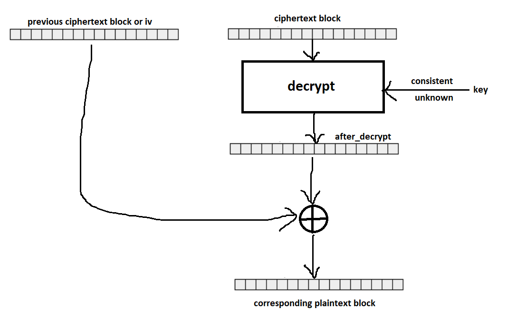
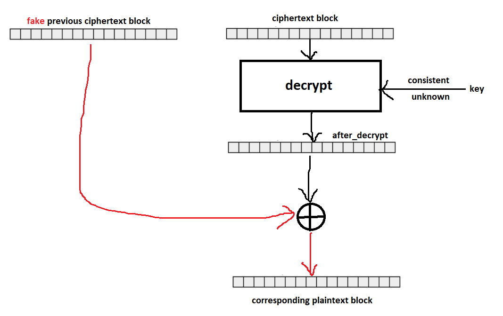
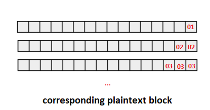
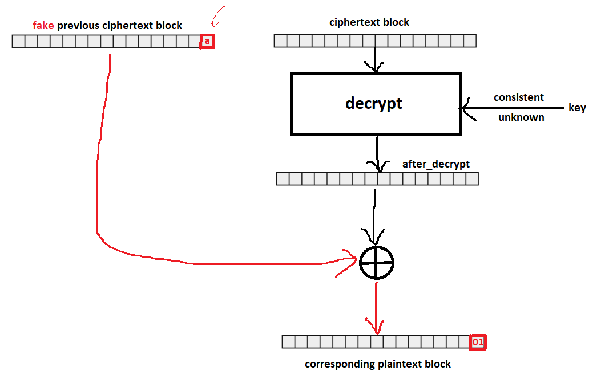
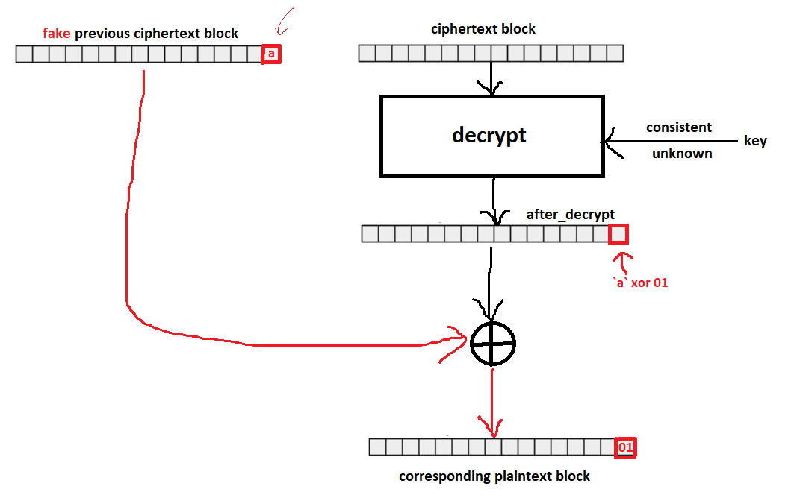
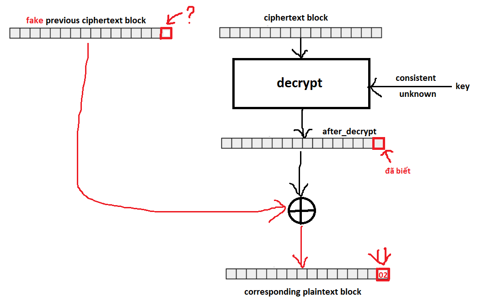
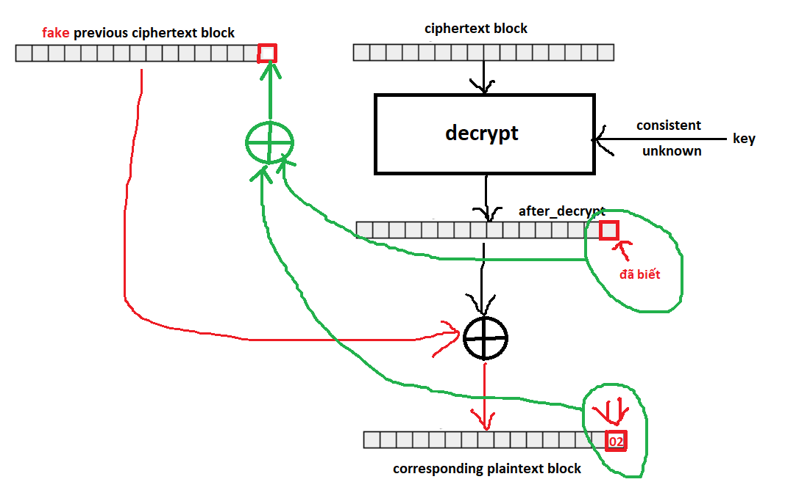
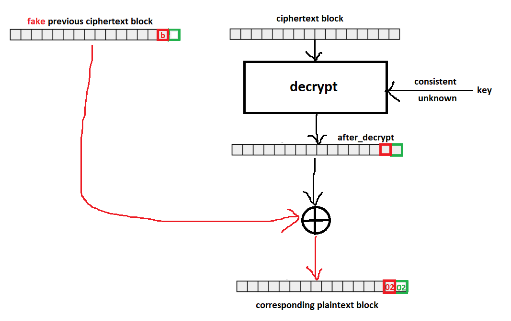

# **[set 3 - challenge 17](https://cryptopals.com/sets/3/challenges/17): The CBC padding oracle**

## Remind
Đầu tiên là nói lại về CBC decrypt:
- `ciphertext block` sẽ được đưa vào `hàm decrypt` với `consistent_but_unknown_key` như các bài trước, tạo ra block mình gọi là `after_decrypt`
- `after_decrypt` sẽ được xor với `previous ciphertext block`, hoặc nếu đang xét block đầu tiên thì sẽ được xor với `iv` để tạo ra `plaintext block`



Tiếp theo là nhắc lại về pkcs7 padding:
- đơn giản là trong block cipher, message cần chia được ra thành các block đầy đủ. Nếu không thì sẽ được thêm vô cuối một thứ gọi là padding để cho đủ.
- pkcs7 hoạt động bằng cách: nếu thiếu `n` ký tự, thì sẽ thêm `n` bytes, mỗi bytes có giá trị là `n`

Hàm kiểm tra padding hợp lệ của pkcs7:
- đọc bytes cuối cùng của plaintext để lấy pad
- ví dụ:
    - với pad = \x01 thì luôn hợp lệ
    - với pad = \x02 thì 2 bytes cuối phải là \x02\x02
    - pad = \x03 thì là \x03\x03\x03
    - ...

## CBC padding attack
Thử thách này, ta sẽ sử dụng một [attack model](https://en.wikipedia.org/wiki/Attack_model) gọi là [Chosen-ciphertext attack](https://en.wikipedia.org/wiki/Chosen-ciphertext_attack). Bằng cách tạo ra các ciphertext tùy ý để cho vô hàm decrypt, dựa vào các thông tin nhận được để đọc được plaintext hoặc lấy được key.

CBC padding attack: lợi dụng hàm kiểm tra xem padding có hợp lệ hay không, kẻ tấn công có thể lấy được plaintext.
- trong phép toán: `plaintext block` = `previous ciphertext block` xor `after_decrypt`, ta có thể tùy ý thay đổi `previous ciphertext block`
- thông qua kết quả trả về của hàm kiểm tra padding hợp lệ, ta có thể biết được giá trị của `plaintext block` được tạo thành với mỗi `previous cipher block`

Với `previous ciphertext block`, `ciphertext block` và thông tin padding hợp lệ, kẻ tấn công có thể lấy được `plaintext block`.

Giải thích: Xét từng block của ciphertext

Đầu tiên, tìm `after_decrypt`:
- Tìm byte cuối cùng của `after_decrypt`:
    - Đây là cbc decrypt:

        

    - Thay đổi `previous ciphertext block`, gọi là `fake previous ciphertext block`.

        
    
    - Gửi ciphertext = `fake previous ciphertext block` + `ciphertext block` đang xét vô hàm decrypt
    - Bruteforce byte cuối của `fake previous ciphertext block`, khi mà pass qua được hàm kiểm tra padding, `plaintext block` có thể có các trường hợp sau:

        

    - Thay đổi thêm bytes trước đó của `fake previous ciphertext block` thành giá trị bất kì khác trong trường hợp có nhiều kết quả pass padding validate 
    - => chỉ còn đúng một giá trị của byte cuối `fake previous ciphertext block` pass padding validate, gọi giá trị này là `a`:

        

    - có bytes cuối của `fake previous ciphertext block` và `plaintext block`, xor 2 bytes này với nhau, ta tìm được byte cuối của `after_decrypt`:

        

- Ký hiệu byte cuối là [-1] theo python, tương tự [-2], ...
- Khi đã có được `after_decrypt`[-1], mục tiêu chuyển sang `after_decrypt`[-2]:
    - Tính giá trị mới đặt vào `fake previous ciphertext block`[-1] để khi xor `after_decrypt`[-1] ra được 2:

        

    - => lấy 02 xor với `after_decrypt`[-1] là ra:

        

    - Lại bruteforce `fake previous ciphertext block`[-2] cho đến khi pass padding validate, khi đó `plaintext block`[-2] = 2:

        

    - Lấy `fake previous ciphertext block`[-2] đó xor với 2, ta tìm được `after_decrypt`[-2]:
- Tương tự, cứ như thế, ta sẽ tìm được hết `after_decrypt`

Khi đã có `after_decrypt`, ta xor nó với **real** `previous_ciphertext_block` là ra được `plaintext block` rồi.

Lặp lại với tất cả các `ciphertext block`, ta sẽ tìm được hết plaintext

## Code
Implement 2 hàm cần thiết của đề bài, các hàm khác trong đó có thể đọc trong [source code](./challenge17.py)):
```
blocksize = 16
consistent_but_unknown_key = urandom(16)
iv = urandom(blocksize)

def challenge17_encrypt():
    plaintext = ten_strings[randint(0, 9)]
    plaintext = base64.b64decode(plaintext)
    plaintext = pkcs7_padding(plaintext, blocksize)

    cryptor = AES.new(consistent_but_unknown_key, AES.MODE_CBC, iv)
    ciphertext = cryptor.encrypt(plaintext)
    
    return ciphertext, iv

def challenge17_check_padding(ciphertext: bytes, iv: bytes) -> bool:
    cryptor = AES.new(consistent_but_unknown_key, AES.MODE_CBC, iv)
    plaintext = cryptor.decrypt(ciphertext)

    if pkcs7_padding_validate(plaintext):
        plaintext = pkcs7_unpadding(plaintext)
        return True
    else:
        return False
```

Viết hàm crack:
- crack_each_block(previous_ciphertext_block: bytes, ciphertext_block: bytes) -> bytes: xử lý từng block
    - do khi tìm `after decrypt`[-1] có trường hợp đặc biệt, nên chia ra xử lý ở đầu hàm trước:
        ```
        after_decrypt = b""

        # Xử lý trường hợp 1 đầu tiên do có trường hợp đặc biệt trong đây
        i = 0
        count = 0 #only for this case, đếm số trường hợp pass padding validate
        for brute_force in range(256):
            fake_previous_ciphertext_block = bytes(16 - i - 1) + bytes([brute_force])

            if challenge17_check_padding(fake_previous_ciphertext_block + ciphertext_block, bytes(blocksize)):
                count += 1 #only for this case
                true_brute_force = brute_force
            
        if count == 1:
            after_decrypt = bytes([true_brute_force ^ (i + 1)]) + after_decrypt
        elif count > 1:
            # Nếu nhiều hơn 1 trường hợp, nghĩa là gặp trường hợp đặc biệt như đã nói trước đó
            # Thay đổi fake_previous_ciphertext_block[-2] khác đi là tìm được kết quả duy nhất
            for brute_force in range(256):
                # thay đổi fake_previous_ciphertext_block[-2] thành b"a"
                fake_previous_ciphertext_block = bytes(16 - i - 2) + b"a" + bytes([brute_force])

                if challenge17_check_padding(fake_previous_ciphertext_block + ciphertext_block, bytes(blocksize)):
                    count += 1 #only for this case
                    true_brute_force = brute_force
        ```
    - các trường hợp còn lại:
        ```
        ## các case còn lại
        for i in range(1, 16):
            for brute_force in range(256):
                fake_previous_ciphertext_block = bytes(16 - i - 1) + bytes([brute_force]) + stream_xor(after_decrypt, bytes([i + 1] * i))

                if challenge17_check_padding(fake_previous_ciphertext_block + ciphertext_block, bytes(blocksize)):
                    true_brute_force = brute_force
                    break
            
            after_decrypt = bytes([true_brute_force ^ (i + 1)]) + after_decrypt
        ```
    - ghép tất cả lại:
    ```
    def crack_each_block(previous_ciphertext_block: bytes, ciphertext_block: bytes) -> bytes:
        after_decrypt = b""

        # Xử lý trường hợp 1 đầu tiên do có trường hợp đặc biệt trong đây
        i = 0
        count = 0 #only for this case, đếm số trường hợp pass padding validate
        for brute_force in range(256):
            fake_previous_ciphertext_block = bytes(16 - i - 1) + bytes([brute_force])

            if challenge17_check_padding(fake_previous_ciphertext_block + ciphertext_block, bytes(blocksize)):
                count += 1 #only for this case
                true_brute_force = brute_force
            
        if count == 1:
            after_decrypt = bytes([true_brute_force ^ (i + 1)]) + after_decrypt
        elif count > 1:
            # Nếu nhiều hơn 1 trường hợp, nghĩa là gặp trường hợp đặc biệt như đã nói trước đó
            # Thay đổi fake_previous_ciphertext_block[-2] khác đi là tìm được kết quả duy nhất
            for brute_force in range(256):
                # thay đổi fake_previous_ciphertext_block[-2] thành b"a"
                fake_previous_ciphertext_block = bytes(16 - i - 2) + b"a" + bytes([brute_force])

                if challenge17_check_padding(fake_previous_ciphertext_block + ciphertext_block, bytes(blocksize)):
                    count += 1 #only for this case
                    true_brute_force = brute_force

        ## các case còn lại
        for i in range(1, 16):
            for brute_force in range(256):
                # craft fake_previous_ciphertext_block
                fake_previous_ciphertext_block = bytes(16 - i - 1) + bytes([brute_force]) + stream_xor(after_decrypt, bytes([i + 1] * i))

                if challenge17_check_padding(fake_previous_ciphertext_block + ciphertext_block, bytes(blocksize)):
                    true_brute_force = brute_force
                    break
            
            after_decrypt = bytes([true_brute_force ^ (i + 1)]) + after_decrypt

        plaintext_block = stream_xor(after_decrypt, previous_ciphertext_block)
        
        return plaintext_block
    ```
- crack():
```
def crack():
    ciphertext, iv = challenge17_encrypt()
    plaintext = b""

    # block 1 có previous ciphertext block là iv
    plaintext += crack_each_block(iv, ciphertext[0:blocksize])

    # từ block 2 trở đi:
    for i in range(blocksize, len(ciphertext), blocksize):
        plaintext += crack_each_block(ciphertext[i - blocksize:i], ciphertext[i:i + blocksize])

    print(plaintext)
```
Kết quả:
```
b"000003Cooking MC's like a pound of bacon\x08\x08\x08\x08\x08\x08\x08\x08"
b'000009ith my rag-top down so my hair can blow\x03\x03\x03'
b'000006And a high hat with a souped up tempo\x05\x05\x05\x05\x05'
b'000000Now that the party is jumping\r\r\r\r\r\r\r\r\r\r\r\r\r'
b'000000Now that the party is jumping\r\r\r\r\r\r\r\r\r\r\r\r\r'
b'000000Now that the party is jumping\r\r\r\r\r\r\r\r\r\r\r\r\r'
b'000009ith my rag-top down so my hair can blow\x03\x03\x03'
b'000009ith my rag-top down so my hair can blow\x03\x03\x03'
```

## References
- Padding oracle attack: https://en.wikipedia.org/wiki/Padding_oracle_attack
- writeup: https://research.nccgroup.com/2021/02/17/cryptopals-exploiting-cbc-padding-oracles/