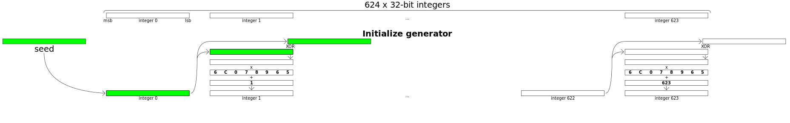
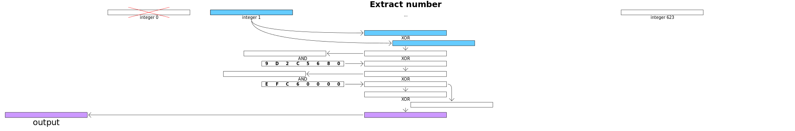
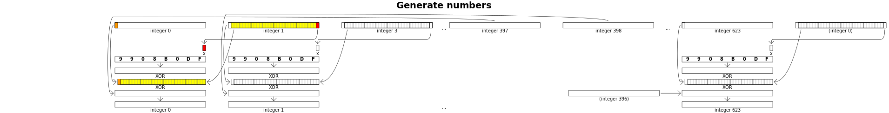

# **[set 3 - challenge 21](https://cryptopals.com/sets/3/challenges/21): Implement the MT19937 Mersenne Twister RNG**

## RNG vs PRNG
RNG: Random number generator
- Hàm sinh ra các số thực sự ngẫu nhiên không thể đoán trước

PRNG: Pseudorandom number generator
- Tuy nhiên, trong máy tính, không có gì là `non-deterministic`
- Nên phải dùng các hàm PRNG để sinh ra dãy số có tính chất ngẫu nhiên
- Tuy nhiên dãy này hoàn toàn có thể xác định được thông qua `initial value`, gọi là PRNG's seed 
## MT19937 Mersenne Twister RNG
MT19937 Mersenne Twister RNG thực chất là PRNG: [wikipedia](https://en.wikipedia.org/wiki/Mersenne_Twister#cite_note-54)

## Implement
Viết các hàm như [pseudocode trên wikipedia](https://en.wikipedia.org/wiki/Mersenne_Twister#Pseudocode) là được:
```
class MT19937_32:
    # coefficients for MT19937 32-bit
    w, n, m, r = 32, 624, 397, 31
    a = 0x9908b0df
    u, d = 11, 0xffffffff
    s, b = 7, 0x9d2c5680
    t, c = 15, 0xefc60000
    l = 18
    f = 1812433253

    MT = [0] * n
    index = n + 1
    lower_mask = (1 << r) - 1
    upper_mask = (1 << w) - 1 - lower_mask

    def __init__(self, seed=5489):
        # seed: 5489 is used in reference C code
        self.seed_mt(seed)

    def seed_mt(self, seed: int):
        self.index = self.n
        self.MT[0] = seed
        for i in range(1, self.n):
            self.MT[i] = (self.f * (self.MT[i - 1] ^ (self.MT[i - 1] >> (self.w - 2))) + i) & ((1 << self.w) - 1)

    def twist(self):
        for i in range(self.n):
            x = (self.MT[i] & self.upper_mask) + (self.MT[(i + 1) % self.n] & self.lower_mask)
            xA = x >> 1
            if x % 2 != 0: # lowest bit of x is 1
                xA = xA ^ self.a
            self.MT[i] = self.MT[(i + self.m) % self.n] ^ xA
        self.index = 0
    
    def extract_number(self):
        if self.index >= self.n:
            if self.index > self.n:
                assert "Generator was never seeded"
            self.twist()
        
        y = self.MT[self.index]
        y = y ^ ((y >> self.u) & self.d)
        y = y ^ ((y << self.s) & self.b)
        y = y ^ ((y << self.t) & self.c)
        y = y ^ (y >> self.l)

        self.index = self.index + 1

        return y & ((1 << self.w) - 1)

if __name__ == "__main__":
    rng = MT19937_32()
    for i in range(10):
        print(rng.extract_number())
```
Trong đó, bao gồm 3 hàm chính:
- mt_seed():
    - Hàm này được gọi 1 lần duy nhất mỗi khi tạo generator mới
    - Từ seed, tạo ra một mảng gồm 624 phần từ, gọi là states
    - Các phép toán có thể tham khảo trên [wikipedia](https://en.wikipedia.org/wiki/Mersenne_Twister#Initialization) và hình vẽ dưới đây:

    

- extract_number():
    - Hàm này trả về một số ngẫu nhiên
    - Bằng cách lần lượt lấy phần tử tiếp theo trong mảng states, sau đó áp dụng một số phép toán vào để tạo ra kết quả
    - Các phép toán có thể tham khảo trong [source code](./challenge21.py) và hình vẽ dưới đây:

    

- twist():
    - Mỗi lần gọi hàm extract_number() sẽ sử dụng một phần tử trong mảng states. Do đó khi dùng hết, hàm twist() sẽ được gọi,với 624 phần tử trong mảng states cũ tạo ra mảng states mới
    - Hàm này cũng được gọi ngay sau khi hàm seed_mt() tạo ra mảng states, chứ không dùng mảng states của seed_mt() để dùng cho extract_number() luôn
    - Các phép toán có thể tham khảo trong [source code](./challenge21.py) và hình vẽ dưới đây:

    


## References
- Pseudorandom number generators | Computer Science | Khan Academy: https://www.youtube.com/watch?v=GtOt7EBNEwQ
- Pseudorandom number generators | Coursera: https://www.coursera.org/learn/crypto/lecture/5m8ay/stream-ciphers-and-pseudo-random-generators
- yield keywork python: https://stackoverflow.com/a/231855