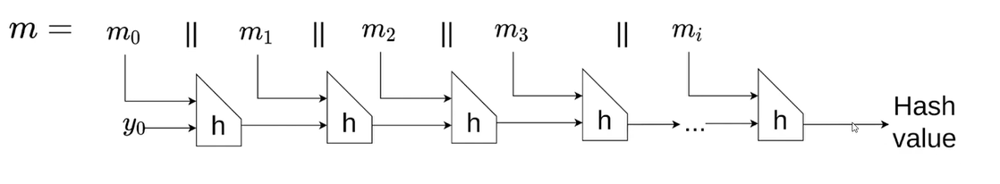
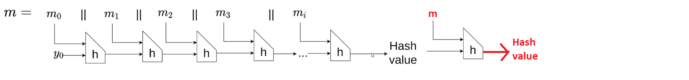

# **[set 4 - challenge 29](https://cryptopals.com/sets/4/challenges/29): Break a SHA-1 keyed MAC using length extension**

Secret-prefix SHA-1 MACs are trivially breakable.

The attack on secret-prefix SHA1 relies on the fact that you can take the ouput of SHA-1 and use it as a new starting point for SHA-1, thus taking an arbitrary SHA-1 hash and "feeding it more data".

Since the key precedes the data in secret-prefix, any additional data you feed the SHA-1 hash in this fashion will appear to have been hashed with the secret key.

To carry out the attack, you'll need to account for the fact that SHA-1 is "padded" with the bit-length of the message; your forged message will need to include that padding. We call this "glue padding". The final message you actually forge will be:

```text
SHA1(key || original-message || glue-padding || new-message)
```

(where the final padding on the whole constructed message is implied)

Note that to generate the glue padding, you'll need to know the original bit length of the message; the message itself is known to the attacker, but the secret key isn't, so you'll need to guess at it.

This sounds more complicated than it is in practice.

To implement the attack, first write the function that computes the MD padding of an arbitrary message and verify that you're generating the same padding that your SHA-1 implementation is using. This should take you 5-10 minutes.

Now, take the SHA-1 secret-prefix MAC of the message you want to forge --- this is just a SHA-1 hash --- and break it into 32 bit SHA-1 registers (SHA-1 calls them "a", "b", "c", &c).

Modify your SHA-1 implementation so that callers can pass in new values for "a", "b", "c" &c (they normally start at magic numbers). With the registers "fixated", hash the additional data you want to forge.

Using this attack, generate a secret-prefix MAC under a secret key (choose a random word from /usr/share/dict/words or something) of the string:

```text
"comment1=cooking%20MCs;userdata=foo;comment2=%20like%20a%20pound%20of%20bacon"
```

Forge a variant of this message that ends with ";admin=true".

## How does SHA1 work

- step 1: padding (divisible by 512-bit):
  - append a bit 1
  - add an amount of 0 bits to the end so that the length of the last block is 448-bit.
  - the last 64-bit is the original length of the input (big-endian)
- step 2: break message into 512-bit chunks
- step 3: main process
  - illustration: [source](https://www.youtube.com/watch?v=QLSlKxAQD8I)

    
    - m0 || m1 || m2 || ...: input
    - y0: value of h0, h1, ..., h4 variables
  - Initialize h0, h1, ..., h4 four-byte variables:
    - h0 = 0x67452301
    - h1 = 0xEFCDAB89
    - h2 = 0x98BADCFE
    - h3 = 0x10325476
    - h4 = 0xC3D2E1F0
  - in the picture, we consider the function `h` as a black box:
    - input: a input chunk and h0, h1, ..., h4 variables.
    - h0, h1, ..., h4 variables will have a new value after processing through the `h` function. And these new values will be passed again to the `h` function with the next input chunk
  - after processing the last input chunk, final hash value is h0 || h1 || ... || h4

## Break

We can take the hash value, treat it as h0, h1, ..., h4, and pass it to the `h` function to continue the hashing process with new block



so the requirement of this attack is:

- mac key must be added before the message, not after.
- we need to forge a new valid padding, so we have to know the length of the original message

## Code

write attack function inside the sha1 class:

```python
def length_extension_attack(self, hash_value: bytes, message_length: int, new_text: bytes):
    # break hash_value into h0, h1, ..., h4
    for i in range(len(self.__H)):
        self.__H[i] = int.from_bytes(hash_value[i*4 : (i+1)*4], byteorder='big')

    # get the message's length after padded
    previous_length = len(SHA1.__padding('a'*message_length))

    # padding new_text, length of new message written to last 8 bytes
    stream = SHA1.__padding(new_text)
    stream = stream[0: -8] + struct.pack(">Q", (previous_length + len(new_text))*8)
    stream = SHA1.__prepare(stream)

    # continue process the new block
    for block in stream:
        self.__process_block(block)

    return self.hexdigest()
```

check:

```python
if __name__ == "__main__":
    recv = sha1_mac(b"comment1=cooking%20MCs;userdata=foo;comment2=%20like%20a%20pound%20of%20bacon")
    
    h = SHA1()
    # 77 is the length of original message
    malicious_hash_value = h.length_extension_attack(recv, 77, b";admin=true")


    # check
    malicious_messsage = b'prefixcomment1=cooking%20MCs;userdata=foo;comment2=%20like%20a%20pound%20of%20bacon\x80\x00\x00\x00\x00\x00\x00\x00\x00\x00\x00\x00\x00\x00\x00\x00\x00\x00\x00\x00\x00\x00\x00\x00\x00\x00\x00\x00\x00\x00\x00\x00\x00\x00\x00\x00\x00\x00\x00\x00\x00\x00\x00\x02\x98'
    malicious_messsage = malicious_messsage + b';admin=true'
    h = SHA1()
    h.update(malicious_messsage)

    print(h.hexdigest())
    print(malicious_hash_value)
    print(h.hexdigest() == malicious_hash_value)
```

result:

```text
97c69cc87848e06f55e183c4cd4493e4e3e05d05
97c69cc87848e06f55e183c4cd4493e4e3e05d05
True
```

## References

- SHA-1:
  - <https://cis.temple.edu/~giorgio/cis307/readings/sha1.html>\
  - <https://www.youtube.com/watch?v=QLSlKxAQD8I>
