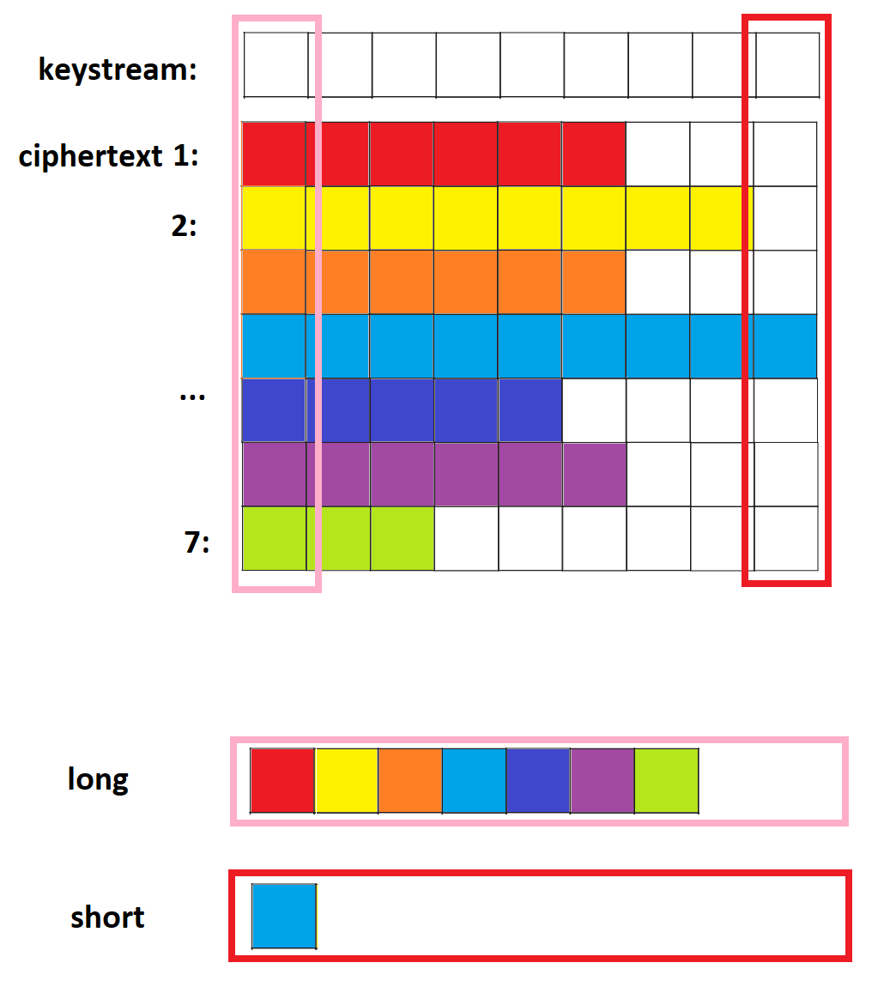

# **[set 3 - challenge 19](https://cryptopals.com/sets/3/challenges/19): Break fixed-nonce CTR mode using substitutions**

## insecure
CTR mode giống như OTP ở chỗ ciphertext được tạo thành bằng cách xor với một keystream dài:


Vấn đề ở chỗ, nếu mỗi lần ta encrypt một plaintext khác nhau:
- nonce không thay đổi
- counter đếm lại từ đầu

=> keystream được tạo ra giống hệt nhau, xảy ra lỗi 'two time pad'
- Mọi byte đầu tiên của plaintext cùng xor với byte đầu tiên của keystream
- Mọi byte thứ hai của plaintext cùng xor với byte thứ hai của keystream

## Ý tưởng
Sử dụng kỹ thuật single-byte xor attack như challenge 3 là oke:
- Ghép tất cả các ký tự cùng vị trí của mỗi ciphertext, ta sẽ được một string mới, trong đó mỗi ký tự string này đều được mã hóa bằng single-byte key



- Tuy nhiên, mỗi ciphertext sẽ có độ dài khác nhau, có dài có ngắn => càng ở những vị trí cuối, string được ghép lại sẽ ngày càng ngắn đi, độ chính xác khi dùng english letter frequency analysis càng thấp.

Nên sẽ chỉ giải mã đến hết độ dài của ciphertext ngắn nhất.
## Code
Implement lại hàm đánh giá câu english, hàm cracking_single_xor của challenge3:

python code:
```
def crack():
    list_plaintext = input.strip(b"\n").split(b"\n")
    list_plaintext = [base64.b64decode(line) for line in list_plaintext]
    list_ciphertext = []
    for p in list_plaintext:
        list_ciphertext.append(CTR(p, consistent_but_unknown_key, nonce))

    #######################################################################
    # Bắt đầu, chúng ta có một list các ciphertext: list_ciphertext

    len_longest_ciphertext = min([len(line) for line in list_ciphertext])
    key = b""

    # Ghép tất cả các kí tự ở vị trí i của từng ciphertext thành một
    # Rồi xử lý như challenge3, single-byte xor
    for i in range(len_longest_ciphertext):
        a = b"".join([bytes([line[i]]) if i < len(line) else b"" for line in list_ciphertext])

        temp_key, _, _ = cracking_single_xor(a)
        key += bytes([temp_key])

    for ciphertext in list_ciphertext:
        print(stream_xor(key, ciphertext))
```
Kết quả:
```
b'T&have mes!|hem at c'
b'^iming wisi(vivid fa' 
b'[tom counsdz or desk' 
b'Xoghteento,kentury h' 
b'T&have patrmd with a' 
b"Rt polite'lmaningles" 
b'Rt have lnooered awh' 
b'Milite mefoangless w' 
b'\\hd thougou(before I'
b'R` a mocknoo tale or' 
b"Ii please'`(companio" 
b'\\tound thb!nire at t'
...
```
Đã khá giống với câu tiếng anh, tuy nhiên một số cột bị sai.

Hàm đánh giá englishFreqMatchScore dùng trong các challenge3, challenge6 khá đơn giản, nên tính điểm không được tốt. Nếu có hàm đánh giá câu english tốt hơn thì kết quả sẽ đẹp hơn. Nhưng đây không phải điểm quan trọng của bài này nên ta chỉ đến đây thôi.
## References