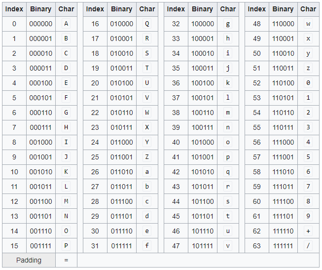
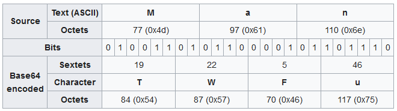
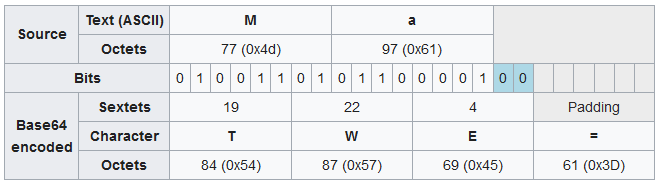
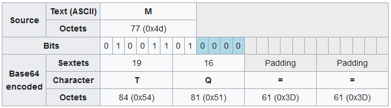

# **[set 1 - challenge 1](https://cryptopals.com/sets/1/challenges/1): Convert hex to base64**

The string:

```text
49276d206b696c6c696e6720796f757220627261696e206c696b65206120706f69736f6e6f7573206d757368726f6f6d
```

Should produce:

```text
SSdtIGtpbGxpbmcgeW91ciBicmFpbiBsaWtlIGEgcG9pc29ub3VzIG11c2hyb29t
```

So go ahead and make that happen. You'll need to use this code for the rest of the exercises.

Cryptopals Rule

```text
Always operate on raw bytes, never on encoded strings. Only use hex and base64 for pretty-printing.
```

## Base64

Base64 is:

- a encoding scheme: represents binary data in an ASCII string format.
- designed to carry data stored in binary formats across channels that only reliably support text content.

### How does base64 work

Each 6 bits will be encoded according to the base64 table:


Padding characters might be added to make the last encoded block contain four Base64 characters. => length of base64 output always divisible by 4

### Examples

Ex1: 3 bytes



Ex2: 2 bytes => needs 1 padding character (=)



Ex1: 1 bytes => needs 2 padding characters (==)



## Solutions

```bash
┌──(kali㉿kali)-[~]
└─$ echo "49276d206b696c6c696e6720796f757220627261696e206c696b65206120706f69736f6e6f7573206d757368726f6f6d" | xxd -r -p | base64
SSdtIGtpbGxpbmcgeW91ciBicmFpbiBsaWtlIGEgcG9pc29ub3VzIG11c2hyb29t
```

- xxd: make a hexdump or do the reverse
  - -r: revert
  - -p: Output in postscript continuous hexdump style. Also known as plain hexdump style.
- base64: base64 - base64 encode/decode data and print to standard output

## Flag

```bash
┌──(kali㉿kali)-[~]
└─$ echo "49276d206b696c6c696e6720796f757220627261696e206c696b65206120706f69736f6e6f7573206d757368726f6f6d" | xxd -r -p 
I'm killing your brain like a poisonous mushroom 
```

## References

Base64:

- <https://viblo.asia/p/base64-nhung-dieu-ban-can-biet-3P0lPePp5ox>
- <https://en.wikipedia.org/wiki/Base64>
