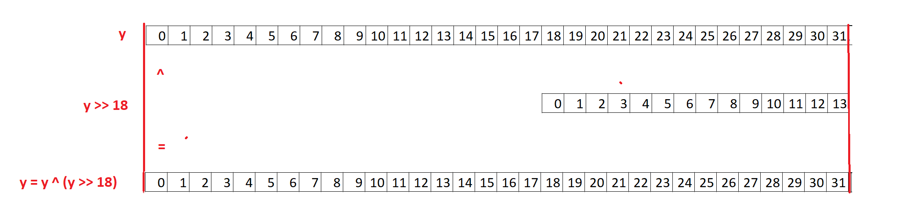
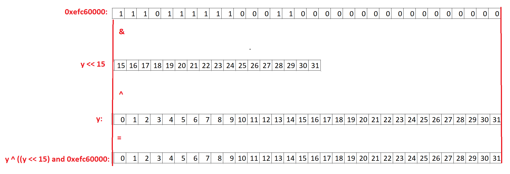
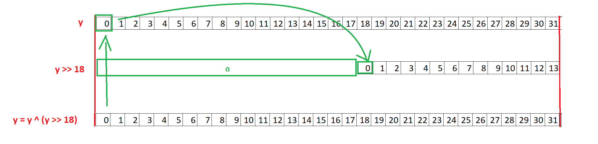

# **[set 3 - challenge 23](https://cryptopals.com/sets/3/challenges/23): Clone an MT19937 RNG from its output**

## Tìm hiểu vấn đề
Như đã miêu tả trong challenge 21: Trong MT19937 có một mảng states gồm 624 phần tử, các số ngẫu nhiên sẽ dựa vào mảng này để sinh ra. Mỗi khi tạo được 624 số ngẫu nhiên, hàm twist() sẽ được gọi để biến đổi 624 phần tử mảng states cũ để tạo ra mảng states mới và tiếp tục tạo số ngẫu nhiên từ mảng mới này.

Nếu như ta có thể lấy được tất cả 624 phần tử trong một mảng states, ta có thể dùng hàm twist() để sinh ra các mảng states kế tiếp => có thể tạo ra một RNG giống y hệt (từ states đó trở đi) mà không cần biết seed của nó.

Theo như đề bài thì ta sẽ dựa vào output: 624 số ngẫu nhiên được sinh ra bởi hàm extract_number() để suy ngược lại 624 phần tử trong states

## Đảo ngược hàm extract_number()
Viết lại quá trình sinh ra một số ngẫu nhiên từ một phần tử trong mảng states (MT):
```
    y = self.MT[self.index]
    y = y ^ (y >> self.u)                   # u = 11
    y = y ^ ((y << self.s) & self.b)        # s = 7 , b = 0x9d2c5680 
    y = y ^ ((y << self.t) & self.c)        # t = 15, c = 0xefc60000
    y = y ^ (y >> self.l)                   # l = 18
    y = y & ((1 << self.w) - 1)
```
Thay số:
```
    y = state
    y = y ^ (y >> 11)
    y = y ^ ((y << 7) & 0x9d2c5680)
    y = y ^ ((y << 15) & 0xefc60000)
    y = y ^ (y >> 18)  
    y = y & (0xffffffff)
```

Ta đi ngược từ dưới lên, mục tiêu là từ số cuối cùng tìm ngược lại được state:
- y = y & (0xffffffff):
    - Do y không quá 32 bit nên phép toán này coi như bỏ

- Trong 4 phép toán ở trên thì phân ra làm 2 loại chính:
    - Một là xor với (chính nó dịch phải):

    

    - Hai là xor với (chính nó dịch trái and với hằng số)

    

- Do 2 phép toán trên đều có một toán hạng đã dịch trái hoặc dịch phải, nên ta biết chắc chắn ở chỗ đó bit có giá trị là 0. => có thể lợi dụng điều này, lần lượt tìm từng bit của y ban đầu.

    

- Với trường hợp xor với (chính nó dịch phải), ta có thể đi từ trái sang phải để tìm từng bit của y ban đầu:
```
def invert_rightshift_xor(y: int, shift: int):
    original = 0

    for i in range(1, 32 + 1):
        # Lấy i bit đầu tiên của y
        temp_y = y >> (32 - i)
        temp_original = original >> (shift - 1)

        original = temp_y ^ temp_original

    return original
```
- Với trường hợp xor với (chính nó dịch trái and với hằng số) thì khó hơn một chút, lần này ta đi từ phải sang trái:
```
def invert_leftshift_and_xor(y: int, shift: int, and_const: int) -> int:
    original = 0

    for i in range(1, 32 + 1):
        # Lấy i bit cuối cùng của y và and_const
        temp_y = y & ((1 << i) - 1)
        temp_and_const = and_const & ((1 << i) - 1)

        # Lấy i - shift bit cuối cùng của original đã tính được
        if i - shift > 0:
            temp_original = original & ((1 << (i - shift)) - 1)
        else:
            temp_original = 0

        # invert
        original = temp_y ^ (temp_and_const & (temp_original << shift))

    return original
```
- Ghép lại làm hàm untemper, ngược lại với chiều xuôi của MT19937:
```
def untemper(y: int):
    y = invert_rightshift_xor(y, 18)
    y = invert_leftshift_and_xor(y, 15, 0xefc60000)
    y = invert_leftshift_and_xor(y, 7, 0x9d2c5680)
    y = invert_rightshift_xor(y, 11)

    return y
```

## Check
- Thứ mà attacker có chính là 624 số ngẫu nhiên của rng gốc:
```
# just for this challenge, don't use time() for seed
seed = int(time())
rng = MT19937_32(seed)

# Lấy 624 số ngẫu nhiên đầu tiên của rng, lưu vào mảng recv, đấy là thứ mà attacker có
recv = []
for i in range(624):
    recv.append(rng.extract_number())
```
- Sử dụng hàm untemper() ở trên, tạo ra clone rng:
```
# Khôi phục lại mảng MT thông qua đảo ngược 624 số ngẫu nhiên
inverted_MT = []
for i in range(624):
    inverted_MT.append(untemper(recv[i]))

# Tạo clone_rng với MT thay bằng inverted_MT ở trên, thay index = 624 để kích hoạt twist
clone_rng = MT19937_32()
clone_rng.MT = inverted_MT
clone_rng.index = 624
```
- Kiểm tra xem tất cả 624 số ngẫu nhiên tiếp theo của 2 rng xem có bằng nhau hay không:
```
print(all([rng.extract_number() == clone_rng.extract_number() for _ in range(624)]))
```
- Kết quả:
```
True
```
=> Clone thành công. Source code [here](./challenge23.py)
## References

