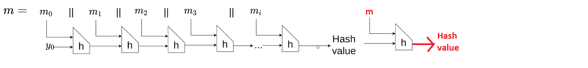

# **[set 4 - challenge 29](https://cryptopals.com/sets/4/challenges/29): Break a SHA-1 keyed MAC using length extension**

Ở challenge 28, ta đã implement sha1 bằng code python có sẵn trên google.

Để giải quyết được challenge 29 thì ta cần tìm hiểu xem sha1 hoạt động như thế nào.
## SHA1: 
- Đầu tiên SHA1 sẽ padding input sao cho độ dài của input chia hết cho 512(bit):
    - Thêm bit 1 vào cuối
    - Thêm một số lượng bit 0 vào cuối sao cho độ dài block cuối là 448(bit)
    - Giá trị độ dài ban đầu của input sẽ được đưa vào cuối block với dạng 64 bit
- Input sẽ được chia làm n block, mỗi block 512 bit
- Từng block sẽ được đưa vào một hàm xử lý, trong đó:
    - sha1 khởi động với 5 hằng số, mỗi hằng số là 4 byte, gọi là h0, h1, ..., h4
    - Khi xử lý một block, các h0, h1, ..., h4 sẽ được cập nhật giá trị mới thông qua các phép toán liên quan đến block và các giá trị h0, h1, ..., h4 hiện tại
    - Khi xử lý block tiếp theo, tiếp tục sử dụng các `h` của block trước
    - Khi xử lý xong block cuối cùng, ghép tất cả các h0, h1, ..., h4 lại với nhau ta được hash value (5 * 4 = 20 byte = 160 bit)
    - hình minh họa: [source](https://www.youtube.com/watch?v=QLSlKxAQD8I)

    

    - Trong hình:
        - m0, m1, m2, ... là các block được chia ra từ input
        - y0, chính là h0, h1, ..., h4

## Break
Ta nhận thấy Hash value chính là các h0, h1, ..., h4 ghép lại. Ta có thể tiếp tục quá trình hash bằng cách lấy Hash value tách ra thành các h0, h1, ..., h4, lấy các giá trị này để tiếp tục quá trình băm:



Khi đó ta sẽ có một Hash value mới mà phần input gốc vẫn được giữ nguyên trong khi đã thêm nội dung vào phần sau. 

Sử dụng tính chất này, ta có thể thay đổi nội dung của message, mà vẫn giữ nguyện được MAC ở đầu message.

Điều kiện:
- Biết độ dài message gốc: vì ta phải fake phần padding, trong đó có phần là độ dài của message.


## Code
Thay đổi code sha1 đã implement trong bài trước để có thể thay đổi h0, h1, ..., h4, tiếp tục hàm xử lý block:
```
def length_extension_attack(self, hash_value: bytes, message_length: int, new_text: bytes):
    # break hash_value into h0, h1, ..., h4
    for i in range(len(self.__H)):
        self.__H[i] = int.from_bytes(hash_value[i*4 : (i+1)*4], byteorder='big')

    # sử dụng hàm __padding có sẵn để lấy độ dài của message cũ
    previous_length = len(SHA1.__padding('a'*message_length))

    # sử dụng hàm __padding để padding new_text, thay 8 bytes ở cuối thành độ dài mới
    stream = SHA1.__padding(new_text)
    stream = stream[0: -8] + struct.pack(">Q", (previous_length + len(new_text))*8)
    stream = SHA1.__prepare(stream)

    # tiếp tục xử lý từng block mới
    for block in stream:
        self.__process_block(block)

    return self.hexdigest()
```
Kiểm tra:
```
if __name__ == "__main__":
    recv = sha1_mac(b"comment1=cooking%20MCs;userdata=foo;comment2=%20like%20a%20pound%20of%20bacon")
    
    h = SHA1()
    # coi như đã biết độ dài của message ban đầu là 6 + 77 = 83
    malicious_hash_value = h.length_extension_attack(recv, 83, b";admin=true")


    # Kiểm tra
    malicious_messsage = b'prefixcomment1=cooking%20MCs;userdata=foo;comment2=%20like%20a%20pound%20of%20bacon\x80\x00\x00\x00\x00\x00\x00\x00\x00\x00\x00\x00\x00\x00\x00\x00\x00\x00\x00\x00\x00\x00\x00\x00\x00\x00\x00\x00\x00\x00\x00\x00\x00\x00\x00\x00\x00\x00\x00\x00\x00\x00\x00\x02\x98'
    malicious_messsage = malicious_messsage + b';admin=true'
    h = SHA1()
    h.update(malicious_messsage)

    print(h.hexdigest())
    print(malicious_hash_value)
    print(h.hexdigest() == malicious_hash_value)
```
Kết quả:
```
97c69cc87848e06f55e183c4cd4493e4e3e05d05
97c69cc87848e06f55e183c4cd4493e4e3e05d05
True
```
=> Đã tìm được hash value cho message đã thay đổi nội dung ở cuối dù không biết secret-prefix MAC


## References
- SHA-1:
    - https://cis.temple.edu/~giorgio/cis307/readings/sha1.html\
    - https://www.youtube.com/watch?v=QLSlKxAQD8I