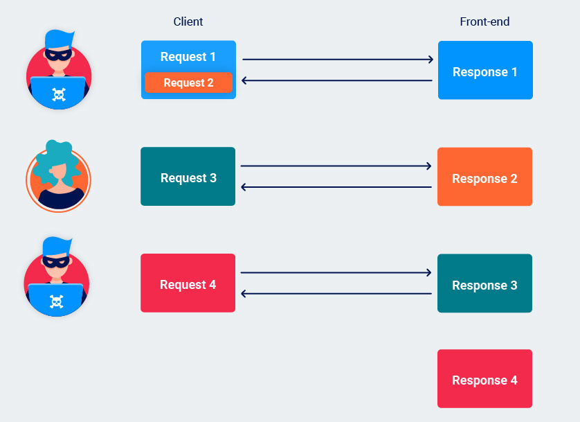

# [Lab: Response queue poisoning via H2.TE request smuggling](https://portswigger.net/web-security/request-smuggling/advanced/response-queue-poisoning/lab-request-smuggling-h2-response-queue-poisoning-via-te-request-smuggling)

## Lab

This lab is vulnerable to request smuggling because the front-end server downgrades HTTP/2 requests even if they have an ambiguous length.

To solve the lab, delete the user `carlos` by using response queue poisoning to break into the admin panel at `/admin`. An admin user will log in approximately every 15 seconds.

The connection to the back-end is reset every 10 requests, so don't worry if you get it into a bad state - just send a few normal requests to get a fresh connection.

## response queue poisoning

The front-end correctly maps the first response to the initial "wrapper" request and forwards this on to the client. As there are no further requests awaiting a response, the unexpected second response is held in a queue on the connection between the front-end and back-end.

When the front-end receives another request, it forwards this to the back-end as normal. However, when issuing the response, it will send the first one in the queue, that is, the leftover response to the smuggled request.

The correct response from the back-end is then left without a matching request. This cycle is repeated every time a new request is forwarded down the same connection to the back-end.

## Detected H2.TE

- burpsuite active scan: detected hidden http 2
- burpsuite `HTTP request smuggler` extension (HTTP 2 probe): detected `HTTP/2 TE desync v10a h2path`
- smuggler.py: bad

## Attack

